# Caspien

Caspien is a systems programming language for code that has to be *audited*, not just written. Its type checker
refuses programs it cannot show to terminate, to respect ownership, and to avoid runtime faults such as
out-of-bounds indexing, null dereference, division by zero and unproven floating point operations.
It compiles to native x86-64 code through a four-stage compiler written in Java.

```rust
import "stdlib/libc.caspien"
import "stdlib/gt_init.caspien"
import "stdlib/gt_destruct.caspien"
import "stdlib/gt_moved.caspien"

func main() void{
	unsafe extern{
		printf("Hello World!\n")
	}
	return
}
```

> **Status.** Caspien is a research language and a working compiler, not a finished product. Section 1.4
> says exactly which of the guarantees below are enforced today and which are still aspirations. Both the language
> and the compiler are unstable: syntax, semantics, the standard library and the compiler's command-line and
> configuration interfaces may change without notice, and no stable version has been released. Reaching one is a
> goal we are working towards.

**Contents**

1. [The language](#1-the-language): philosophy, a tour with examples, and an honest status report
2. [Using the compiler](#2-using-the-compiler): building, running, targets, every optimisation switch, the standard library and the file system
3. [How the compiler works](#3-how-the-compiler-works)
4. [Performance](#4-performance): latest benchmark results and an honest comparison with other languages

---

## 1. The language

### 1.1 Philosophy

The idea behind Caspien is not so much rapid prototyping as building and maintaining auditable codebases. Code that is accepted by the compiler carries properties that other languages ask you to take
on trust: it terminates, it does not use memory it does not own, and it has no hidden runtime failure
paths. The language is verbose and explicit on purpose, because every explicit annotation is something a
reviewer, an auditor or another tool can check.

The model behind this is the **run-to-completion total slice**. A program is a flat, single event loop.
Each iteration of the loop handles one event, which is a slice of time, and the handler for that event is a
*total* function: it is guaranteed to return a result for every input, with no non-termination, no
exception and no undefined behaviour, absent a hardware fault. The loop itself is the only unbounded
construct, and it lives in a small, auditable place. (The project's working name for this idea was
*Time-Slice TIDAG*, or Turing Incomplete Directed Acyclic Graph. "Total slice" says the same thing in terms that match the literature.)

Four properties make a handler total:

1. **Bounded loops over an acyclic call graph.** The call graph has no cycles: direct and mutual
   recursion are compile errors. The only recursion allowed is a tail call on a strictly shrinking
   range, which the compiler rewrites into a bounded `for` loop. Every `for` loop runs over a range that
   is fixed when the loop starts, and its counter cannot be assigned. Unbounded `loop{}` needs `unsafe`.
   This is the discipline of Meyer and Ritchie's LOOP language (1967): safe Caspien code corresponds to
   primitive recursive computation, which is a strict subset of what a Turing machine computes. A
   handler can run for a very long time, but it cannot fail to stop.
2. **Memory safety by ownership.** Every heap value has exactly one `owns` pointer. Moving it invalidates
   the old name at compile time. A `ref` is a pointer that does not own: it can be null or stale, so its
   members are reachable only inside `match Some(...)`, which checks at run time that the target is alive.
   Array and dynarray indexes must be proven in bounds before use.
3. **No runtime exceptions.** Division requires a proof that the divisor is not zero. Float arithmetic
   requires a proof that the operand is finite. Narrowing an integer requires either a proof that it fits
   or an explicit `wrap` or `sat`. Integer arithmetic wraps and never traps. The only non-local control
   flow is `throw`, which is declared with `@throws`, must be handled with `?catch` or `try`/`catch`, and
   whose handler must end in `return`, `throw` or `continue`.
4. **Explicit escape.** Everything the checker cannot prove goes in an `unsafe` block, which is easy to
   find, count and review. All C calls, `loop{}` and raw pointer dereference are in that category.

Two limits are worth stating plainly, because they separate Caspien from the claims it is sometimes
confused with:

- **Termination is not bounded time.** A nested bounded loop with large bounds can run for years. A
  scheduler that must meet deadlines also needs a worst-case execution time per slice. Caspien proves the
  first guarantee and `--audit` reports the second in abstract gas units (a fixed cost per operation, not
  seconds), exact for literal loop bounds and marked unbounded otherwise (see "Bounded execution time" below).
  The shape of the language makes it tractable: loop bounds are ordinary range values, and an acyclic call
  graph gives a static bound on stack depth (estimated by `--audit`).
- **"Total" is relative to the primitives.** The guarantee is conditional on the escape hatches. A C
  function called from `unsafe`, or an `unsafe loop{}`, can do anything.

The idea sits in a family of established work: total functional programming (Turner, 2004), the LOOP
language (Meyer and Ritchie, 1967), synchronous languages such as Esterel (Berry and Gonthier, 1992) and
Lustre (Halbwachs, Caspi, Raymond and Pilaud, 1991), WCET analysis (Wilhelm et al., 2008), and
run-to-completion cooperative kernels. Caspien's contribution is to combine totality with ownership-based
memory safety in a low-level language with a conventional imperative surface.

### 1.2 A tour of the language

This section is a guide to writing idiomatic Caspien. It goes from the shape of a program to the features
that need the most care, and each part ends with the errors you will meet first. The examples are excerpts
from the programs in [`docs/examples/`](docs/examples). Each program is complete, compiles, and prints the
output shown in its header comment, so you can run it and change it. The code blocks use the `rust` syntax
hint only because GitHub has no Caspien highlighter.

| Part | Program |
|---|---|
| [Values](#values-mutability-and-types), [structs, methods and enums](#structs-methods-and-enums) | [`01_basics`](docs/examples/01_basics.caspien) |
| [Proofs](#proofs-instead-of-runtime-checks) | [`02_proofs`](docs/examples/02_proofs.caspien) |
| [Ownership](#ownership-and-pointers) | [`03_ownership`](docs/examples/03_ownership.caspien) |
| [Termination](#bounded-loops-and-bounded-recursion) | [`04_termination`](docs/examples/04_termination.caspien) |
| [Interfaces](#interfaces), [generics](#generics-and-compile-time-dispatch), [`par`/`await`](#atomics-locks-and-threads) | [`05_abstraction`](docs/examples/05_abstraction.caspien) |
| [Locks](#locks-and-proofs-on-your-own-types) | [`06_locks`](docs/examples/06_locks.caspien) |
| [Program entry and event loops](#program-entry-main-arguments-and-event-loops) | [`07_main_c_args`](docs/examples/07_main_c_args.caspien), [`08_main_safe_args`](docs/examples/08_main_safe_args.caspien), [`09_event_loop`](docs/examples/09_event_loop.caspien) |
| [Functions, overloading, `@pure`](#functions-overloading-and-pure), [generics](#generics-and-compile-time-dispatch) | [`10_functions`](docs/examples/10_functions.caspien) |
| [Composition](#composition-there-is-no-struct-inheritance), [interfaces](#interfaces), [dispatch](#generics-and-compile-time-dispatch) | [`11_types`](docs/examples/11_types.caspien) |
| [`match`](#the-match-statement), [loops, bounded recursion](#bounded-loops-and-bounded-recursion) | [`12_match_and_loops`](docs/examples/12_match_and_loops.caspien) |
| [Dynamic arrays and the standard library](#dynamic-arrays-and-the-standard-library) | [`13_dynamic_arrays`](docs/examples/13_dynamic_arrays.caspien) |
| [The standard library](#25-the-standard-library): collections, strings, hashing | [`20_stdlib_tour`](docs/examples/20_stdlib_tour.caspien) |
| [Files and directories](#26-files-and-directories) | [`21_files`](docs/examples/21_files.caspien) |
| [Processes, threads, sleeping](#25-the-standard-library) | [`22_processes_threads_sleep`](docs/examples/22_processes_threads_sleep.caspien) |
| [Raw pointers and C](#unsafe-and-raw-pointers) | [`14_unsafe_pointers`](docs/examples/14_unsafe_pointers.caspien) |
| [Every `unsafe` tag](#unsafe-and-raw-pointers) | [`19_unsafe_tags`](docs/examples/19_unsafe_tags.caspien) |
| [`extern`, `export`, linking your own C](#talking-to-c-extern-and-export) | [`docs/c_interop/`](docs/c_interop/) |
| [Inline assembly](#inline-assembly-asm), [`assume match`](#vouching-for-a-proof-assume-match) | [`18_asm_and_assume`](docs/examples/18_asm_and_assume.caspien) |
| [`throw`, `try`, `?`](#errors-throw-try-) | [`15_errors`](docs/examples/15_errors.caspien) |
| [Atomics, locks, threads](#atomics-locks-and-threads) | [`16_atomics_and_locks`](docs/examples/16_atomics_and_locks.caspien) |
| [Locked structs, `Result`, constructors](#locks-and-proofs-on-your-own-types) | [`17_locked_results`](docs/examples/17_locked_results.caspien) |

#### The shape of a program

```rust
import "stdlib/libc.caspien"
import "stdlib/gt_init.caspien"
import "stdlib/gt_register.caspien"
import "stdlib/gt_alive_check.caspien"
import "stdlib/gt_destruct.caspien"
import "stdlib/gt_moved.caspien"

@pub
func answer() mut u64{
	return 42
}

func main() void{
	let a = mut answer()
	unsafe extern{ printf("%llu\n", a) }
}
```

- A file is a list of declarations: `import`, `func`, `struct`, `enum`, `interface`, `impl`, `extern`,
  `let static`. Imports are resolved relative to the importing file.
- Every program that uses `new`, `owns` or `ref` requires the four `gt_*` decorated functions (`@gt_init`,
  `@gt_register`, `@gt_alive_check`, `@gt_destruct` and `@gt_moved`) to be defined in the final compilation unit. Basic
  defaults are available in `stdlib/`, and the examples import them. They implement the runtime registry
  that tracks which heap values are alive, and they are ordinary Caspien source, not compiler magic.
  `libc.caspien` declares the C functions, and calling any C function, `printf` included, needs an `unsafe`
  block.
- Blocks use braces and statements need no semicolons. A `@decorator` goes on **its own line** above the
  declaration it changes. Several decorators are several lines. `@pub @realizes func f()` on one line is a
  parse error.
- `main` takes no arguments and returns `void`, `bool` or `s32` (the entry-point section at the end of this
  tour covers arguments and event loops).
- Everything has to be bound with `mut` or `imut` before it is stored. Arguments to C functions are the
  exception: C has no notion of mutability, so literals and expressions can be passed to `printf` and its
  kin directly.

#### Values, mutability and types

Every value is `mut` or `imut`, and you write it. There are no implicit conversions between integer
types, so a literal takes the type of the slot it lands in, and a variable never silently changes width.

```rust
let count = mut 1
count += 1                           // fine: `count` is mut
let limit = imut 10                  // `limit += 1` would be rejected: the value is imut

let wide = mut 200
match wide fits u8{                  // a proof that the narrowing is safe
	let narrow = mut wide as u8
}
let big = mut 300
let wrapped = mut wrap:<u8>(big)     // explicit: keep the low bits (here 44)
let clamped = mut sat:<u8>(big)      // explicit: clamp to the range (here 255)
```

Integers are `u8` to `u64` and `s8` to `s64`; floats are `f32` and `f64`; there are also `bool`, `char`,
fixed arrays (`u64[5]`), ranges (`0..10`) and strings. A literal such as `5` is a `u64` unless the slot it
lands in says otherwise, and a literal that does not fit is an error. `as` only widens within one
signedness family. Narrowing needs a `fits` proof, `wrap` or `sat`. Hex, binary and underscore literals
work (`0xFF_FF`, `0b1010`), and the bitwise builtins are `bits_and`, `bits_or`, `bits_xor`, `bits_not`,
`bits_left`, `bits_right`, `bits_rotl` and `bits_rotr`, with one fully defined shift rule for every width
(rotates take the count modulo the width).

#### Functions, overloading and `@pure`

A function declares each parameter with its mutability, and the return type follows the parameter list.
Several functions can share one name. They are told apart by their parameter count and by the **base
type** of each parameter. Mutability, storage, parameter names and return types never distinguish two
overloads, so `f(x: mut u64)` and `f(y: imut u64)` are duplicates.

```rust
func describe(x: mut u64) mut u64{ return 1 }
func describe(x: mut u8) mut u64{ return 2 }
func describe(x: mut u64, y: mut u64) mut u64{ return 3 }
func describe(x: static imut string) mut u64{ return 4 }

describe(5)        // 1: a bare literal is a u64, so the u64 overload is an exact match
describe(small)    // 2: `small` is a u8 variable
describe(c, c)     // 3
describe("hi")     // 4
```

A call tries the overloads that need no literal adaptation first and then the rest in declaration order,
and takes the first whose parameters accept the arguments. Overloading needs no decorator: it is implicit.
Methods and constructors overload the same way, and are covered with structs below. These are the errors:

```
function 'f' with this parameter signature is already declared
no overload of 'f' matches argument types (f32)
```

**`@pure`** marks a function with no side effects. It is not the same as referentially transparent: a `@pure`
function may read through a pointer argument, so the same call can return different results as the
pointee changes, and it may call the built-in `insecure_rand()` or allocate (`new`, `dyn`, `resize`, `clone`),
which are side-effect-free but non-deterministic (the result depends on state the arguments do not determine,
and running out of memory is part of the program's semantics). The checker enforces it call by call (it is not
transitive, so each function in a chain carries the decorator):

```rust
@pure
func sq(x: mut u64) mut u64{ return x * x }

@pure
func hyp(a: mut u64, b: mut u64) mut u64{
	let s = mut sq(a)
	let t = mut sq(b)
	return s + t
}
```

A `@pure` function may call only other `@pure` functions. It may not call an extern or a function pointer,
read a `mut` global, write through any pointer, `throw`, contain an `unsafe` block (so no `asm`, `memcopy`,
`swap` or unsafe dynarrays), use `match @lock` (acquiring the lock writes the mutex and blocks), or start or wait
on a thread (`par`, `await`, `@par` loops). Local variables, arithmetic and `for` loops are fine.

```
'f' is '@pure' and can only call other '@pure' functions -- 'impure' is not
'f' is '@pure' and cannot read 'G' -- it is a mutable global/static variable
'f' is '@pure' and cannot mutate through a pointer -- ...
'f' is '@pure' and cannot 'throw' -- an unconditional program termination can never be verified at compile time
'f' is '@pure' and cannot use an 'unsafe' block -- unsafe code can do anything the compiler cannot check, so purity could not be guaranteed
'f' is '@pure' and cannot use 'match @lock' -- acquiring the lock writes the mutex and blocks (a retry loop on shared state)
```

**`@pure(rt)`** is referentially transparent: the same arguments always give the same result. It has every
`@pure` rule above plus: no value of a pointer type (`ref`, `raw`, `owns`, `auto`, `static`) or dynamic array
anywhere (parameters, return type, locals, expressions), so it cannot read memory the arguments do not
determine; no globals or statics; no allocation (`new`, `dyn`, `resize`, `clone`), no `deref`, no
`insecure_rand()`; and it may call only other `@pure(rt)` functions. Safe code has no unbounded loop, so every
loop in an `rt` function is a `for` range or a `@recursive` bounded loop and the function always terminates.
**`@non(deterministic)`** marks a function whose result may differ for equal arguments (a `@pure` function can
carry it); a `@pure(rt)` function cannot call one, and `@pure(rt)` and `@non(deterministic)` cannot be combined
on one function.

```rust
@pure(rt)
func poly(x: mut u64) mut u64{
	let s = mut 7
	for i in 0..8{ s = s * 31 + x + i }
	return s
}
@pure
@non(deterministic)
func roll() mut u64{ return insecure_rand() }
```

```
'f' is '@pure(rt)' and can only call other '@pure(rt)' functions -- 'g' is only '@pure'
'f' is '@pure(rt)' (referentially transparent) and cannot use 'new' -- allocation depends on heap state (it can fail), so the result is not a function of the arguments
'f' is '@pure(rt)' (referentially transparent) and cannot have a pointer or dynamic array ('ref_some_mut_W') as parameter 'p' -- it may not read memory through pointers
```

`@reads` and `@writes` (each takes one or more of `all`, `self`, `others`, `globals`) are accepted and
checked for shape, but nothing enforces them yet. Treat them as documentation.

#### Structs, methods and enums

A struct lists its members, with `@pub` to make them visible outside the file. Methods live in `impl`
blocks. The receiver is an explicit `_self` parameter, and methods use Lua-style self bolting: `x:name(args)`
is exactly `x.name(x, args)`. The receiver is evaluated once and bolted on as the first argument, so
`acct:deposit(50)` and `acct.deposit(acct, 50)` are the same call, and the colon form is the one to write.
There is no hidden `this`: what the method receives is the first argument you can see. A struct
value cannot be passed by value as a parameter: pass a pointer, or return the struct, which the compiler
implements without a copy.

```rust
struct Account{@pub{
	id: mut u64
	balance: mut u64
}}

impl Account{
	@pub
	func deposit(_self: ref some mut self, amount: mut u64) void{
		_self.balance += amount
	}
}

enum Shape{ CIRCLE, SQUARE, TRIANGLE }
```

The receiver type `ref some mut self` is a non-null pointer to the value that does not own it (see *Ownership and
pointers*), and the examples build the value with `new`, which allocates it on the heap (`?` handles an
allocation failure; see *Errors*).

Methods overload like functions, by parameter count and base type, inside a bare `impl`. A `static` method
has no receiver and is called on the type (`Q.make()`). Overloading is implicit, with no decorator:

```rust
struct Q{@pub{ a: mut u64 }}
impl Q{
	@pub
	func add(_self: ref some mut self, n: mut u64) mut u64{ return _self.a + n }
	@pub
	func add(_self: ref some mut self, s: static imut string) mut u64{ return _self.a + 1000 }
	@pub
	static func make() mut u64{ return 5 }
	@pub
	static func make(n: mut u64) mut u64{ return n }
}
```

**Constructing a struct.** A struct literal must name every member exactly once, so there is no way to leave
a member unset and safe code never sees uninitialised memory. This is the *One True Constructor* (OTC)
policy, and the literal is the one true way to make a value. A struct can also declare constructors, with
`impl constructor for T(...) self` (generic form: `impl<T> constructor for Box<T>(...)`). They overload by
parameter type like any function, and once a struct has one, its literal form is legal only inside the
constructors' own bodies. Everyone else writes `P(...)`, or `new P(...)` for a heap value:

```rust
struct P{@pub{ a: mut u64 }}
impl constructor for P(n: mut u64) self{ return P{a= n} }
impl constructor for P(s: static imut string) self{ return P{a= 99} }

let pa = mut P(mut 4)
```

```
'Q' already has a method named 'add' with this parameter signature in this impl block
struct 'Point' literal is missing member(s): y
'P' declares its own constructor(s) -- its struct-literal form ('P{...}') can only be used inside one of those constructors' own bodies; ...
```

A locked struct (see *Locks and proofs on your own types*) has one narrow exception to the first rule.

#### Composition (there is no struct inheritance)

A struct cannot extend another struct and there are no abstract types. Share members by putting one struct
inside another, and share behaviour with an interface (below). Every struct carries a hidden 8-byte class id
in front of its members; the compiler numbers all structs in one flat `Class` enum, and that id is what
makes `instanceof` possible (see *Interfaces*).

```rust
struct Legs{@pub{ count: mut u64 }}
struct Dog{@pub{
	legs: mut Legs
	name: mut u64
}}
let dog = mut Dog{legs= Legs{count= 4}, name= 7}
```

- `@untyped` drops the class id, which saves 8 bytes and bars `instanceof` and `implements` on that type.

#### Interfaces

An interface is a list of method signatures. A type implements it in an `impl Interface for Type` block.
Every method there must be `@pub`, must carry `@realizes`, and the block must match the interface's method
set exactly.

```rust
interface Greeter{
	id(_self: ref some imut self) imut u64;
	@default
	func twice(n: mut u64) imut u64{ return 2 * n }
}

impl Greeter for A{
	@pub
	@realizes
	func id(_self: ref some imut self) imut u64{ return 1 }
}
impl Greeter for B{
	@pub
	@realizes
	func id(_self: ref some imut self) imut u64{ return 2 }
	@pub
	@overrides
	func twice(n: mut u64) imut u64{ return 7 }
}
```

- `@realizes` marks a method that fulfils a plain signature. `@default` marks an interface method that has
  a body, which every implementer inherits. `@overrides` marks a method that replaces a `@default`.
  Each is required where it applies and forbidden where it does not, so the compiler tells you which
  you meant (`... realizes 'G's 'id' and must be labelled '@realizes'`, `'@overrides' is for overriding a
  '@default' method`).
- A `@default` body cannot mention `self`: it has no receiver, so it works as a shared helper. A default
  `static func` is not usable yet.
- A block `impl Interface for T` cannot overload, because an interface method is identified by name alone.
- `x instanceof S` takes an interface-typed `x` and a struct name `S`. It is one class-id comparison, and inside
  `match x instanceof S{...}` `x` is narrowed to `S` (read its members inside `match Some(x)` as usual).
- `x implements I` takes a struct-typed `x` and an interface name `I`.
- Both are run-time tests and must be inside `match Some(...)` when `x` is a pointer, like any other use of
  the pointer.
- `@guard` interfaces describe a lock and are covered with the locks below.

A call on a value of a concrete type is a direct call. A call through an interface-typed pointer is
dispatched at run time:

```rust
func total(s: ref some imut Shape) imut u64{
	let a = imut s.area(s)       // which `area` runs depends on what `s` points at
	let t = imut s.tag(s)
	return a + t
}
```

The compiler generates one dispatcher per interface method, which checks that the pointer is alive and
compares the object's class id against each implementer in turn. There is no vtable, and that is why the
`gt_*` imports are required for such a call. A method with no `self`-typed parameter cannot be called this
way. When the type is known statically, prefer a bounded generic (`func f<T: Shape>(...)`), which compiles
to a direct call.

#### Generics and compile-time dispatch

Generics use `:<T>` at the use site and `<T>` at the declaration. Each instantiation is compiled as its own
ordinary function or struct (`Box:<u64>` becomes `Box_u64`, with its own `Box_u64_get`), so there is no
run-time cost and nothing is looked up at run time.

```rust
struct Box<T>{@pub{ v: mut T }}
impl<T> Box<T>{
	@pub
	func get(_self: ref some mut self) mut T{ return _self.v }
}
func twice<T>(x: mut T) mut T{ return x }

let b = mut ? new Box:<u64>{v= 7}
let t = mut twice:<u64>(mut 9)
let bv = mut b.get(b)
```

A generic method has its own parameter (`func conv<U>(...)`, called `b.conv:<U>(b, ...)`). A method that is
illegal for some `T` is simply unavailable for that `T` instead of being an error at the declaration, so
`DynamicArray:<Rect>` exists even though its by-value `pushBack` does not (use `pushBackPtr`).

A type parameter can carry an interface bound. The bound is checked at every instantiation, and the call
inside is dispatched at compile time to the concrete implementation:

```rust
func areaOf<T: Shape>(s: ref some imut T) imut u64{ return s.area(s) }

let ra = imut areaOf:<Rect>(r)       // calls Rect's area directly
```

Everything in this list is resolved by the compiler and costs nothing at run time: overload selection,
generic instantiation, bounded generic calls, a method call on a value of a concrete type, `@pure`
checking, and every proof. The only run-time dispatch in the language is a call through an interface-typed
pointer and the `instanceof` and `implements` tests, described under Interfaces.

#### The `match` statement

`match` is the one construct Caspien uses for branching on a type, a state or a proof, and it comes in two
shapes. The parser tells them apart by the body: if its first line looks like `LABEL:{`, it is a case-match.
Otherwise it is a proof-match.

**Case-match.** It switches on an enum, or on the three states of a float. It must name every case, and
`A|B:{...}` shares one body. There are no literal cases (`match x{ 0:{...} }` does not parse): dispatch on
a plain value with `if`, `elseif` and `else`.

```rust
enum Color{ RED, GREEN, BLUE }

func warm(c: imut Color) mut u64{
	match c{
		RED:{ return 1 }
		GREEN|BLUE:{ return 2 }
	}
	return 0
}

// An enum marked @non_exhaustive lists `default` as its last variant. A match on it needs a `default` case
// exactly when some variant isn't named; if every variant is named, `default` is an error.
@non_exhaustive
enum Level{ LOW, MID, HIGH, default }

func level(l: imut Level) mut u64{
	match l{
		LOW:{ return 10 }
		default:{ return 99 }       // `default` catches every variant not named above, so MID and HIGH land here
	}
	return 0
}

func twice(x: mut f32) mut f32{
	match x{
		finite:{ return x * 2.0 }       // arithmetic on `x` is allowed only here
		infinite:{ return 0.0 }
		nan:{ return 0.0 }
	}
	return 0.0
}
```

```
match on 'Color' isn't exhaustive -- missing: BLUE
match on 'mut_f32' isn't exhaustive -- missing: infinite
match on '@non_exhaustive' enum 'Level' needs a 'default' case as the last one -- uncovered: MID, HIGH
'default' is unreachable: every variant of 'Level' is already covered by name
```

**Proof-match.** The condition is something the compiler can use as evidence, and the block runs only when
it holds. `elsematch` and `else` chain after it like `else if` and `else` (an `else` must start its own
line). These are the conditions:

| Condition | What the block may do |
|---|---|
| `b != 0` (unsigned), `b > 0` (signed) | divide or take a remainder by `b` |
| `Some(p)` | use the pointer `p`: it is alive |
| `x fits T` | write `x as T` (narrow or change sign) |
| `i in arr` / `i into arr` | read / write `arr[i]` (also `Some(i) in arr`, which also proves the element alive) |
| `r is base` | `r` is an empty range (the base case of a recursion) |
| `a within b` | `a` is a strict sub-range of `b` (the recursive case) |
| `x instanceof T`, `x implements I` | use `x` as that type |
| `c1 and c2` | both proofs |
| `@lock` | see the locks below |

```rust
func pick(n: mut u64, d: mut u64) mut u64{
	match n fits u8{
		let small = mut n as u8
		return small as u64
	}
	elsematch d > 0{
		return n / d
	}
	else{
		return 7
	}
}
```

A proof lives only inside its block, and nesting is fine. Writing to anything the proof mentions
(the divisor, the index, the array) ends it, and the next use gets the original "not proven" error. A
bare expression such as `x == 0` is not a proof and is rejected: write `match Some(...)` if you meant that
a pointer is not null. A match chain in which every branch returns makes any statement after it an error
(`unreachable code`), and `match k in a and k in b{}` is rejected, so nest the two matches instead.

#### Proofs instead of runtime checks

Where another language would insert a check that can fail, Caspien asks you to prove the condition, and
the proof is a `match` whose body is only reachable when it holds.

```rust
func divide(a: mut u64, b: mut u64) mut u64{
	match b != 0{
		return a / b            // without the match, this line is a compile error
	}
	return 0
}

func scale(x: mut f32) mut f32{
	match x{
		finite:{ return x * 2.0 }
		infinite:{ return 0.0 }
		nan:{ return 0.0 }
	}
	return 0.0
}

for match i in values{          // only indexes proven to be inside `values`
	total += values[i]
}

match i into squares{           // `in` proves reading, `into` proves writing
	squares[i] = i * i
}

func readNode(n: ref mut Node) mut u64{     // `Node` has a `value: mut u64` member
	let r = mut 0
	match Some(n){              // `n` may be null: it is proven alive only inside this block
		r = n.value
	}
	return r
}
```

These are the error messages for the most common attempts to skip a proof:

```
'/' requires the divisor to be proven nonzero first (`match z != 0{...}` for an unsigned type ...), or 'unsafe' code
'[]' is not permitted here -- the index must be a literal integer, provably within bounds
'/' on an unproven 'f32' isn't permitted -- prove it first with 'match a{ finite:{...} ... }'
member access on a pointer-typed struct value is not permitted -- the type system can't yet confirm it isn't null
```

Two details of bounds proofs. A *literal* index into a fixed array needs no proof (the compiler checks it
against the length), but any index into a dynarray needs one, because its length exists only at run time.
And a proof is tied to one array: indexing two arrays inside one loop takes two nested matches.

#### Locks and proofs on your own types

`@lock` on a struct turns one member into a **discriminant** and makes every other member unreadable until a
`match` on the discriminant has said it is safe. It is the same proof mechanism as `match b != 0`, applied to
a type you define. The discriminant is an enum member, and it must be the struct's first member. There are
two kinds. A `swap` atomic (`OPEN` or `CLOSED`) is a spin lock, described under *Atomics, locks and threads*.
An ordinary `imut` enum is a **proof lock**, which is how a type can carry data that is only sometimes there.
The classic use is a result:

```rust
enum ResultState{ OK, FAIL }

@lock(match self.state : OK)
struct Result<T>{@pub{
	state: imut ResultState
	payload: mut T
}}
```

`payload` is reachable only inside a `match` on `state` that selected `OK`. The `FAIL` case never gets to
touch it, and neither does code that forgot to look. The discriminant is `imut`, so it cannot change after
construction and a proof of it cannot go stale:

```rust
let r = mut halve(10)               // a function returning Result<u64>
match r.state{
	OK:{ total += r.payload }       // the proof holds here
	FAIL:{ total += 0 }             // r.payload would be rejected here
}
```

```
'payload' requires a 'match r.state{...}' proof first (this struct is decorated '@lock(match self.state : ...)')
```

**Constructing a locked value.** The One True Constructor policy and constructor implementations (see
*Structs, methods and enums*) apply unchanged: a struct literal names every member, and a struct that
declares constructors can be built only through them. A `Result<T>` normally has two, one for each state:

```rust
impl<T> constructor for Result<T>(v: mut T) self{
	return Result:<T>{state= ResultState.OK, payload= v}
}
impl<T> constructor for Result<T>() self{
	return Result:<T>{state= ResultState.FAIL}       // payload is left out, see below
}

func halve(n: mut u64) mut Result<u64>{
	if n % 2 == 0{ return Result:<u64>(n / 2) }
	return Result:<u64>()
}
```

A locked struct adds one exception to the first rule. It may leave out **every** member except the
discriminant, but only when the discriminant is `imut` and is written as a direct `Enum.Variant` that does
**not** satisfy the lock. The compiler is then certain the other members can never be read, so it lets them
stay uninitialised. This is the only place the language allows uninitialised data, and it is safe because
safe code can never reach it. It works in a plain literal as well:

```rust
@lock(match self.status : LIVE)
struct Reading{@pub{
	status: imut Sensor
	value: mut u64
}}

let live = mut Reading{status= Sensor.LIVE, value= 7}
let dead = mut Reading{status= Sensor.DEAD}          // value is never initialised and never readable
```

These are the errors for getting it wrong:

```
'Result_u64' declares its own constructor(s) -- its struct-literal form ('Result_u64{...}') can only be used inside one of those constructors' own bodies; ...
'Result_u64' cannot be constructed by omitting its other members -- 'ResultState.OK' satisfies this struct's own lock ('@lock(match self.state : OK)'), so every other member must be provided instead
omitting every other member of 'Result_u64' requires 'state' to be given as a direct 'ResultState.Variant' reference -- never a variable or a call result, so the mismatch can be proven at compile time
struct 'Result_u64' literal is missing member(s): state
```

**Every use of `@lock`.** The same decorator appears in several places, each described where it is used:

| Form | On | Meaning |
|---|---|---|
| `@lock(match self.f : V)`, `f` an `imut` enum | struct | a proof lock: the other members need a `match` on `f` that selects `V` (this section) |
| `@lock(match self.f : OPEN)`, `f` a `swap` atomic | struct | a spin lock: the other members need `match @lock x{ OPEN:{...} }` |
| `@lock(match self.f : V)` | method | the caller must already be inside the matching `match` |
| `@lock(match i in self.a)` | method | the caller must hold a bounds proof for `i` (`into` for writes) |
| `@lock`, `@unlock` | method of a `@guard` implementer | the two operations behind `lock x{ ... }` |

The full example is `17_locked_results`.

#### Ownership and pointers

Caspien has five kinds of pointer, and the kind says who is responsible for the target:

| Kind | Meaning |
|---|---|
| `owns` | responsible for a heap value: it frees it (and makes it unreachable) when its scope ends. Assigning or passing it **moves** that responsibility to the new slot and the old name is dead at compile time. It may hold null (a moved-from slot is null); freeing null does nothing |
| `ref` | points at a heap value but is not responsible for it, and does take part in the ownership model: its members are reachable only inside `match Some(...)`, which checks at run time that a live allocation is registered at that address. It can be null, or point at something freed long ago, and then the block is skipped |
| `auto` | the address of a live local variable, never null, and so usable without a check (it points at no heap memory, so it needs no responsibility) |
| `static` | a pointer to static storage. A string literal is a `static imut string` (likewise no heap, no responsibility) |
| `raw` | a C-style pointer outside the model: nothing is checked and nothing is freed. Making and dereferencing one needs `unsafe` |

Every pointer slot either has responsibility for its target or it does not; that is the whole model, and memory safety
comes from each kind behaving as its kind says. There is no borrowing in the sense Rust uses the word, where something is
lent and has to come back: ownership that is moved is simply gone from the caller, and nothing in the contract returns it.

```rust
func steals(s2: owns mut String){ }       // s2 is now responsible for the String
...
steals(s)                                  // s no longer owns it: using `s` after this line is a compile error
```

`steals` may return the same `String`, but nothing requires it to. There are also no lifetime annotations, because a `ref`
has no lifetime in its type to annotate: it says only "I do not own this, check me before use", and the check is done at run
time.

`new` allocates, and it can fail, so it goes through `?`. A pointer that might be absent is declared `owns
some` (never null) or plain `owns` (possibly null), and a `some` pointer needs no check.

```rust
@throws
func makeNode(v: mut u64) owns some mut Node{
	?catch(e){ throw e }                 // declared once, applies to every `?` below it
	return ?new Node{value= v}
}

func readNode(n: ref mut Node) mut u64{
	let r = mut 0
	match Some(n){                       // the block runs only if the target is alive
		r = n.value
	}
	return r
}
```

Using a value after moving it is a compile error: `use of 'b' after its ownership was moved`.

A struct held directly in a variable counts as an owner too when one of its members is `owns` (at any depth): it is
dropped when its scope ends, and copying it (`let b = a`, `b = a`, putting it in another struct literal or a `dyn`
literal) moves its owned members, so `a` can no longer be used. Copying one out of a pointer with `deref` is an error;
use `clone` instead.

#### Bounded loops and bounded recursion

Every loop in safe code is a `for` over a range that is fixed when the loop starts. The counter cannot be
assigned, and the bounds are read once, so assigning the variable the range came from does not change how
many times the loop runs. An empty range (`5..5`) and an inverted one
(`7..3`) run zero times. `break` leaves a loop and `continue` starts its next iteration (see "Control flow" below).

```rust
let n = mut 5
for i in 0..n{              // runs exactly 5 times, whatever `n` becomes
	n += 100
}

for i in arr{ ... }          // i runs over the indexes 0..len of a fixed array
for match i in v{ s += v[i] }   // only indexes proven to be inside `v`
for i in 0..3{
	for j in i..3{ ... }     // nested loops may use the outer counter in their range
}
```

The same loop works directly over a dynamic array, and `match` in the header proves the index for you. `into`
proves it for writing, and `Some(i)` additionally proves that the element `ps[i]` (a pointer) is alive:

```rust
for i in d{ n += 1 }                              // i runs over 0..len(d)
for match i in d{ s += d[i] }                     // read d[i]
for match i into d{ d[i] = d[i] * 2 }             // write d[i]
for match Some(i) in ps{ s += ps[i].a }           // ps is a dynarray of owned pointers: read through ps[i]
for match Some(i) into ps{ ps[i].b = 7 }          // ... or write through it
```

A bare `loop{}` has no bound and needs `unsafe` (the `loop` tag). The only exception is the `@event_loop`
function (see the end of this tour).

```rust
let n = mut 0
unsafe loop{
	loop{                    // runs until something breaks out of it
		n += 1
		if n == 5{ break }
	}
}
```

#### Control flow: `break`, `continue` and lazy chains

`break` leaves the **innermost** enclosing `for` (or `loop`) and carries on after it. It can sit inside
any number of `if` or `match` blocks within that loop, and it is the only way to end a loop early:

```rust
for i in 0..6{
	if i == 4{ break }           // prints i=0..3, then leaves the loop
	unsafe extern{ printf("i=%llu\n", i) }
}
for i in 0..3{
	for j in 0..3{
		if j == 1{ break }       // leaves the inner loop only: prints j=0 once per i
		unsafe extern{ printf("i=%llu j=%llu\n", i, j) }
	}
}
```

A `break` inside `match @lock ... OPEN` releases the lock on the way out (see "Atomics, locks and threads").
Using `break` outside a loop is an error.

`continue` in a `for` starts the next iteration (the counter still steps, and the bound is not re-read); in a
`loop` it goes back to the top of the body. Like `break`, it frees the owns locals declared so far in the body,
and it can sit inside any `if` or `match` within the loop:

```rust
let odd = mut 0
for i in 0..10{
	if i % 2 == 0{ continue }     // skip the even numbers
	odd += i                      // 1 + 3 + 5 + 7 + 9 = 25
}
```

`continue` has two older meanings, and the innermost construct around it decides which one applies:

- at the end of a `catch(e){ ... }` handler it jumps to just past the enclosing `try{ ... }` block (see
  "Errors"). If a loop is opened inside the handler, a `continue` in that loop belongs to that loop,
- in the `CLOSED` case of a `match @lock` it retries the acquire. The `OPEN` case has no `continue`, since the
  lock is held there.

Anywhere else it is rejected: `'continue' can only be used inside a 'for' or 'loop' (next iteration), inside a
'catch(e) { ... }' block, or directly in the 'CLOSED' case of a 'match @lock'`. To get "next iteration" from
inside a `catch` handler, wrap the loop body in a `try{ ... }` block: the handler's `continue` then lands at the
end of the body.

An `if` or `elseif` condition made with `&&` or `||` evaluates **both** sides, as it is plain logic on two
values. To make the chain lazy, write `&&then` or `||then`. The right side then runs only when the left side
has not already decided the answer: `a &&then b` skips `b` when `a` is false, and `a ||then b` skips `b` when
`a` is true. The compiler emits a compare-and-jump after each link instead of combining the two values, so a
skipped operand is never called and its side effects never happen. A chain is evaluated left to right, and
links can be mixed:

```rust
func noisy(name: static imut string, r: mut bool) mut bool{
	unsafe extern{ printf("  called %s\n", name) }
	return r
}

if noisy("a", false) && noisy("b", true){ ... }              // calls a, then b
if noisy("a", false) &&then noisy("b", true){ ... }          // calls a only
if noisy("c", true) ||then noisy("d", true){ ... }           // calls c only
if noisy("e", false) &&then noisy("f", true) ||then noisy("g", true){ ... }
                                                             // calls e, then g (f is skipped)
```

`&&then` and `||then` are written with or without a space (`&& then`), are only allowed at the root of an
`if` or `elseif` condition (not inside a function argument, an assignment or a `match`), and `then` is not
a reserved word elsewhere.

Recursion is limited to one shape, because the compiler must be able to turn it into a bounded loop. A
`@recursive` function:

1. takes an `imut range` as its **last** parameter,
2. starts with `match r is base{ ... }`, which returns when the range is empty,
3. makes one self-call, as the sole expression of a `return`, inside `match r2 within r{ ... }`, where
   `r2` is a range strictly inside `r`,
4. ends that match with an `else` branch.

```rust
@recursive
func fact(acc: mut u64, r: imut range) mut u64{
	match r is base{ return acc }
	let lo = mut (r.start + 1)
	let hi = mut r.end
	let r2 = imut (lo..hi)
	match r2 within r{ return fact(acc * r.start, r2) }
	else{ return acc }
}
// fact(1, 1..11) == 3628800: the compiler lowers this to a `for` loop that runs 10 times.
```

The range is the termination argument: it shrinks on every call, and `within` is a compile-time proof that
it does. A range that shrinks by one runs as many steps as it has elements, and one that shrinks from
both ends runs half as many (rounded up). The equivalent loop is shorter, and is usually what you want:

```rust
func factLoop(n: mut u64) mut u64{
	let acc = mut 1
	let hi = mut (n + 1)
	for i in 1..hi{ acc *= i }
	return acc
}
```

Always write the `else` branch. A plain `return acc` statement after the `within` match compiles
without an error and returns the wrong value, because the lowered loop falls through into it. Any other
form of recursion is rejected:

```
'f' calls itself -- recursion is not allowed unless the function is decorated '@recursive'
indirect recursion detected: 'b' calls 'a', which (directly or transitively) calls back to 'b' ...
a '@recursive' function must have an 'imut range' as its final parameter
a recursive call to 'f' may only appear as the sole expression of a 'return' statement ...
'i' is immutable for the duration of this 'for'/'for match' loop ...
'loop' can only be used from within 'unsafe' code
```

#### Dynamic arrays and the standard library

A fixed array (`u64[5]`) has its length in its type. A dynamic array (dynarray) has its length in a hidden
header and lives on the heap, so creating or growing one can fail and goes through `?`.

```rust
?catch(e){ return }                       // see "Errors" below

let zero = mut 0
let d = mut ? dyn:<u64>([])               // an empty array needs its element type
d = ? resize(d, 5, zero)                  // resize returns the array: assign it back
for i in 0..5{
	match i into d{ d[i] = i * 10 }       // every index needs a proof, even a literal one
}
let total = mut 0
for match i in range(d){ total += d[i] }  // iterate the proven indexes
let n = mut len(d)

let lit = mut ? dyn([1, 2, 3])            // or infer the element type from a literal
lit = ? resize(lit, 1, zero)              // growing fills the new slots, shrinking truncates
```

`resize` takes the fill value as a variable (there is no `zero` keyword), and cannot be used inside a loop
over the same array. Iterate a dynarray with `range(d)`: the bare form `for i in d` is accepted by the
checker, but crashes at run time today.

When the elements own memory (`owns` pointers, or structs with an `owns` member), shrinking frees what the cut-off
elements owned, and growing gives each new slot its own deep copy of the fill value, never a shared pointer.

An `unsafe dyn` array has no checks at all: no proofs, no `?` on `resize`, and no protection against an
index past the end. It is for code that has proved the bounds in its own way.

```rust
unsafe udyn{
	let us = mut unsafe dyn:<u64>([])
	us = resize(us, 6)
	for i in 0..6{ us[i] = i * 3 }
}
```

The standard library wraps these in classes, each in its own file under `stdlib/`:

- `DynamicArray<T>` (`new DynamicArray:<u64>()`) has `get`, `set`, `pushBack`, `pushFront`, `popBack`,
  `popFront`. `get` and `set` need an index proof against `list.backing`, and the mutating methods are
  `@throws`, so call them with `?`. The pop methods return the default value you pass when the array is
  empty. `pushBack` reallocates on every call, so it suits small arrays, not hot loops. For a struct
  element type use the `...Ptr` variants (`pushBackPtr(list, auto s)`), which take a pointer.
- `String` (`new String("hello")`) has `appendChar`, `concat`, `charAt`, `setCharAt`, `sub` and
  `firstIndexOf`, which returns -1 when the character is absent.
- `HashMap<T>` (`new HashMap:<u64>(defaultKey, defaultValue, capacity)`) has `set`, `get` and `contains`.
  The capacity is the starting size (rounded up to a power of two; 0 means every `set` is ignored); the table doubles when it is 70% full. There is no remove.
- `insecure_hash.caspien` (FNV-1a, for hash tables only: it is not a security primitive, hence the name) and
  `sha256.caspien` (a real SHA-256), `process.caspien` (spawn a process and read or write its
  pipes), `sleep.caspien`, `par_call.caspien` / `await_call.caspien` (threads).

```rust
let list = mut ? new DynamicArray:<u64>()
for i in 0..5{
	let v = mut (i * i)
	? list.pushBack(list, v)
}
let sum = mut 0
for i in 0..5{
	match i in list.backing{ sum += list.get(list, i) }
}
let top = mut ? list.popBack(list, mut 999)      // 16
```

#### `unsafe` and raw pointers

`unsafe{}` is how a program says "the compiler cannot prove this meets the guarantees of safe code: I have
either proven it myself, or I am choosing to compile code without those guarantees". It is deliberately small, easy
to find and easy to count. What needs it:

- calling any C function (an `extern`),
- making a `raw` pointer (`raw v`), and dereferencing or cloning one (`deref(p)`, `clone(p)`): reading through a `raw`
  pointer is unsafe even when it is proven alive, so it needs the `deref` or `clone` tag as well as the proof (a `match Some(p)` is a
  real run-time check against the ghost table, and `raw` pointers into C memory or the stack are not in it,
  so for those the proof is an `assume match Some(p)`),
- `memcopy`,
- inline assembly (`ASM`) and `assume match`,
- a bare `loop{}`, and an `unsafe dyn` array,
- reading or writing a `mut` global or static that is not atomic or lock-protected.

Anything that safe code proves with a `match` (a `deref` or `clone` of a pointer, a division, an arithmetic or
compare operation on a float, a `@lock` method call) is vouched for in an `unsafe assume{` block with `assume match`, which is an assertion to the type checker
and never runs, so it may name any expression: `assume match Some(p + i)`, `assume match d > 0`, `assume match x : finite`. Nothing else
in `unsafe` relaxes those checks.

A statement-level `unsafe` block must say why it is unsafe, by naming the reasons after the keyword:
`unsafe assume extern{`. The reasons are `extern` (a C call), `memcopy`, `raw` (making a `raw` pointer),
`deref` and `clone` (dereferencing or cloning a `raw` pointer), `global`, `loop`, `udyn` (an unsafe dynarray of plain data) or `udyn:owns` (an unsafe dynarray whose elements own memory: the compiler only frees the block, so you destruct the elements yourself before shrinking or leaving scope), `assume` (`assume match`),
`call` (calling a function pointer), `asm`, `async` (a pointer across an `@async` boundary), `guard` (using a
`@guard` type without proving it locked), `swap` (touching a `swap` mutex field outside `match @lock`) and `file` (opening a path the build's file policy has not vouched for, see 2.6). The
compiler checks the list both ways: a block that needs a reason it does not name is an error, and so is a block
that names one it does not need, so the line is also what you grep for. A bare `unsafe{}` is an error. The one exception is `unsafe unaudited{`: it stands for every tag at once and says nothing about why, for code nobody has audited yet. It is written alone, is just as easy to grep for, and the standard library may never use it (the compiler refuses it in any file under `stdlib/`). (A
root-level `unsafe{}` that holds declarations is not a statement block and takes no list.)

One example of every tag (each is compiled and run in `docs/examples/19_unsafe_tags.caspien`, which also
defines the helpers they use):

```rust
unsafe extern{ printf("%llu\n", n) }                        // extern: call a C function
unsafe raw{ let r = mut (raw v) }                           // raw: make a raw pointer
unsafe memcopy raw{ memcopy(raw dst, mut 8, raw v) }        // memcopy: copy 8 bytes from v to dst
unsafe assume deref raw{                                    // deref: read through a raw pointer ...
	let pv = mut (raw v)
	assume match Some(pv)                                   // assume: ... that you vouch is alive
	seen = mut deref(pv)
}
unsafe clone{ return ?clone(src) }                          // clone: deep copy of a `raw some` pointer
unsafe global{ counter += 3 }                               // global: a mutable static that is not atomic or locked
unsafe loop{                                                // loop: a bare `loop{}`
	loop{
		n += 1
		if n == 5{ break }
	}
}
unsafe udyn{ let a = mut unsafe dyn([10, 20, 30]) }         // udyn: an unsafe dynarray of plain data
unsafe udyn:owns{ let a = mut unsafe dyn([h]) }             // udyn:owns: its elements own memory (here `h` owns a `World`)
unsafe call{ let r = mut call(fp, mut 10) }                 // call: call through a function pointer
unsafe asm{                                                 // asm: an inline `ASM` block (see "Inline assembly")
	ASM relax {
		pause
	}
	relax
}
unsafe async raw{                                           // async: a pointer crosses into an @async function
	let pc = mut (raw cell)
	got = mut ? await readCell(pc)
}
unsafe global guard{                                        // guard: a bare @lock/@unlock call (the safe form is `lock gate{ ... }`)
	gate.lock()
	counter += 8
	gate.unlock()
}
unsafe swap{ m.lockState swap St.CLOSED }                   // swap: touch a swap mutex's state field by hand
unsafe unaudited{ counter = mut deref(pc) }                  // unaudited: any of the above, no reasons given (never in the stdlib)
```

Passing, returning, casting and stepping a `raw` pointer is safe. `raw x` needs an addressable variable (or a
string literal), so bind a computed value to a `let` first. Pointer arithmetic is C's: `p++`, `p--`,
`p += n`, `p -= n`, `p + n` and `p - n` move by `n * sizeof(pointee)` bytes, and `p - q` is the number of
elements between two pointers of the same type, as an `s64`. Widening the pointee with `as` (a `raw u8` as
`u64`) gives a pointer that steps by 8. `deref(p)` reads a value, and is never an assignment target: write
through a pointer with member assignment on a proven pointer, or with `memcopy`.

```rust
func main() void{
	let count = mut 5
	let bytes = mut (count * sizeof(u64))
	let:<raw mut u8> base = null
	unsafe extern{
		base = mut malloc(bytes)                // the only extern call that allocates
	}
	let p = mut (base as u64)                   // now a `raw u64`: it steps by 8
	let start = mut p
	for i in 0..count{
		let v = mut (i * 10 + 1)
		unsafe memcopy raw{
			memcopy(p, mut 8, raw v)            // memcopy(destination, byteCount, source)
		}
		p++
	}
	let span = mut (p - start)                  // 5 elements
	let q = mut start
	let sum = mut 0
	for i in 0..count{
		unsafe assume deref{
			assume match Some(q)                // vouch that q is alive: it points into C memory, so a real Some(q) would be false
			sum += deref(q)                     // reading through a raw pointer needs the `deref` tag as well
		}
		q++
	}
	unsafe extern{
		free(base)
	}
}
```

Keep each `unsafe` block as narrow as the unsafe operations in it, so that a reviewer can see exactly what
was not proven. The standard library follows that rule: its `unsafe` blocks wrap the `malloc`, `memcopy`
and similar calls and nothing else. These are the errors you will meet:

```
calling extern 'malloc' requires 'unsafe' code
'raw' pointers can only be constructed from within 'unsafe' code
'deref' of a pointer requires 'unsafe' code unless the pointer is proven alive -- ...
'deref(...)' cannot be the target of an assignment -- it yields a copy of the value, not a place to write; ...
'loop' can only be used from within 'unsafe' code
```

#### Vouching for a proof: `assume match`

An ordinary proof is checked: `match i in arr{...}` compiles to a run-time bounds test around the block, and
the block runs only if the test passes. `assume match` states the same condition as true **without testing
it**. It takes the conditions `match` takes, it is allowed only inside `unsafe`, and it is the statement to
reach for when the proof was established somewhere the compiler cannot see, or when the test itself is the
cost (the inner loop of a numeric kernel, say). With no block, the proof holds for the rest of the scope. With
a block, it holds inside the block only:

```rust
unsafe assume{
	for i in a{
		assume match i in a             // no block: holds until the end of the loop body
		total += a[i]                   // no bounds test is emitted for this read
	}
	assume match b != 0{                // a block: holds inside it only
		q = total / b
	}
	assume match r.status : LIVE        // the lock form: satisfies `@lock(match self.status : LIVE)`
	total += r.value
}
```

If the assumption is false the program has undefined behaviour: an out-of-bounds read, a division by zero, a
member that was never initialised. The compiler has been told not to look, so reviewing an `assume match`
means checking the claim yourself. `18_asm_and_assume` is a runnable version.

```
'assume match' is only allowed inside 'unsafe' code
```

#### Talking to C: `extern` and `export`

`extern` declares a function the final program will find at link time, almost always a C function. The
declaration lists the parameter types (no names) and the return type, and `...` as the last parameter marks a
variadic function:

```rust
extern abs(mut s32) mut s32                    // int abs(int)
extern labs(mut s64) mut s64                   // long labs(long)
extern snprintf(raw mut u8, mut u64, static imut string,...) mut s32   // int snprintf(char *, size_t, const char *, ...)

@link_name(labs)                               // a different Caspien name for the same C symbol
extern c_abs(mut s64) mut s64
```

Calling an extern needs `unsafe`, and the compiler does not check an extern's declaration against the real
C header, so a wrong one is as dangerous as it is in C. Match the C types by size and signedness: `s32` is
`int`, `s64` is `long`, `u64` is `unsigned long` or `size_t`, a Caspien `string` is a `const char *`, and a
`raw mut u8` is a byte pointer such as `void *`. `@link_name(symbol)` gives the C symbol when the name you
want differs from it (a Caspien keyword such as `sleep` cannot be an extern's name), and
`@call_convention(name)` selects the calling convention of the C side. Two declarations of one extern in a
program are an error, so shared ones live in a file you import: `stdlib/libc.caspien` declares `printf`,
`malloc`, `free`, `strlen` and the other C functions the standard library and the examples use.

`export name` goes the other way. It names an ordinary top-level function, and the compiler emits it under its
own bare name (no mangling) so that C can declare and call it. The function cannot be overloaded or generic,
because C has neither, and it can be exported once:

```rust
extern c_apply(mut u64, mut u64) mut u64       // defined in helper.c

func add(a: mut u64, b: mut u64) mut u64{ return a + b }
export add                                     // C sees `unsigned long add(unsigned long, unsigned long)`

func main() void{
	unsafe extern{
		let r = mut c_apply(mut 40, mut 2)     // helper.c: return add(a, b) * 2;
		printf("%llu\n", r)                    // 84
	}
}
```

The compiler links only the C library (with `-pthread` and `-lm`). To link your own C files, stop after code generation and let
`gcc` finish the job (with a Linux target in `toolchain.config`):

```
java Compiler --asm -i docs/c_interop/interop.caspien output/interop.s
gcc output/interop.s docs/c_interop/helper.c -o output/interop -no-pie -pthread -lm
```

`docs/c_interop/` has the whole program and a script that builds and runs it. These are the errors:

```
calling extern 'malloc' requires 'unsafe' code
'extern strlen' is already declared
'export add' does not name a declared function
'export f' is ambiguous -- 'f' has 2 overloads, and C has no overloading; only an overload-free function can be exported
'f' is generic and can't be exported -- C has no equivalent of a monomorphized function family
```

#### Inline assembly: `ASM`

`ASM` puts assembly text into the compiler's output exactly as you wrote it. It is the lowest-level hatch in
the language, so it needs `unsafe` everywhere: a root-level `ASM` sits inside an `unsafe{ }` block, and one in
a function sits inside an `unsafe` block of that function. The block's text is not parsed or checked. The
only rules are that its braces balance (braces inside quotes and comments do not count) and that the word
`ASM_END` does not appear in it. It must be in the assembler syntax of your target, which is AT&T for
`linux`.

```rust
// Root level: this defines a C-callable function in assembly. The text is copied where it stands.
unsafe{
ASM {
.text
.globl asm_add3
asm_add3:
	lea (%rdi,%rsi), %rax
	add %rdx, %rax
	ret
}
}
extern asm_add3(mut u64, mut u64, mut u64) mut u64    // call it like any other extern

// The same text kept in a file. The path is relative to the source file.
unsafe{
ASM "18_asm_helper.s"
}

func main() void{
	unsafe asm extern{
		let s = mut asm_add3(mut 1, mut 2, mut 3)    // 6

		ASM relax {                // inside a function a block can be named,
			pause
		}
		relax                      // and then it is emitted wherever its name stands alone on a line
		relax
	}
}
```

An unnamed `ASM { ... }` inside a function is emitted at that point. A named block is scoped like a `let`:
it is visible from its declaration to the end of the enclosing block. The compiler cannot see what the text
does, so the usual assembly rules are yours to keep: leave the stack as you found it and preserve the
callee-saved registers (`rbx`, `rbp`, `r12` to `r15`). A function that contains an `ASM` block is
conservatively left alone by the optimiser: it gets no register variables and its variable passes skip it, and
a program with any `ASM` in it turns off `unused-declaration-removal` as a whole. `18_asm_and_assume` is a
runnable version. These are the errors:

```
declaring 'ASM' requires 'unsafe' code
invoking 'relax' requires 'unsafe' code
```

#### Errors: `throw`, `try`, `?`

There are no exceptions that arrive unannounced. An error is a `throw` of a message, the function that can
throw says so with `@throws`, and every caller must say what happens when it does.

- A function with a `throw` must be marked `@throws`, and a `@throws` function must contain a `throw`.
  `throw` takes a string literal, or the `e` of a `catch` to re-throw it.
- Every call to a `@throws` function, and every `new`, must be wrapped, and the wrapper must be needed:
  wrapping a call that cannot throw is an error too.
- A handler must end in `return`, `throw` or `continue`. It cannot fall through, because a call that threw
  never produced a value to carry on with.
- When a throw leaves a function, every `owns` local in it is freed on the way, and the message is
  delivered to the handler unchanged, however many frames up it is.

The long form is `try EXPR catch(e){ ... }`, where `e` is the message. It is an expression, so it can sit
on the right of a `let`. `?` is shorthand for it. `?catch(e){ ... }` declares a handler, and `? EXPR` is
`try EXPR catch(e){ <the handler most recently declared> }`. Declare it once at the top of a function and
mark each throwing call with `?`:

```rust
@throws
func parse(x: mut u64) mut u64{
	if x > 100{ throw "too big" }
	return x
}

@throws
func middle(x: mut u64) mut u64{
	?catch(e){
		unsafe extern{ printf("middle: saw '%s', passing it on\n", e) }
		throw e                                  // re-throw the same message
	}
	let p = mut ? new Point{x= mut x, y= mut 1}  // freed during the unwind
	let v = mut ? parse(x)
	return v + 1
}

@throws
func top(x: mut u64) mut u64{
	?catch(e){ throw "top: request rejected" }   // a handler may throw a different message
	let v = mut ? middle(x)
	return v * 2
}
```

The function that finally handles an error usually wants to carry on afterwards. `try{ ... }` is a scope
that compiles to nothing, and it must contain at least one real `try`. Its only job is to be where
`continue` lands, so a handler that ends in `continue` skips the rest of the block:

```rust
func run(x: mut u64) void{
	try{
		let r = try top(x) catch(e){
			unsafe extern{ printf("run(%llu): caught '%s'\n", x, e) }
			continue                 // jump to just past the enclosing try{} block
		}
		unsafe extern{ printf("run(%llu): ok, r=%llu\n", x, r) }
	}
	unsafe extern{ printf("run(%llu): done\n", x) }
}
```

The most recent `?catch` applies, so one function can switch handlers part-way through. The declaration is
positional and not scoped, so a `?catch` written inside an `if` stays in effect after it, even when the
branch did not run. It resets at the start of every function. `throw` is safe code, and a catch parameter
is a `static imut string`. These are the errors:

```
call to 'f', which is decorated '@throws', must be wrapped in 'try ... catch { ... }'
'try' wraps a call to 'h', which is not decorated '@throws' -- ... only needed (and only allowed) around a call to a '@throws' function
'g' is decorated '@throws' but its body contains no 'throw' -- remove '@throws' (or add a 'throw')
'g' uses 'throw' but is not decorated '@throws' -- add '@throws' to this function's declaration
'catch' must be terminating -- every path through its body must end in a 'return', a 'throw', or a 'continue' ...
'?' requires a preceding '?catch(e) { ... }' declaration, earlier in this same function, to supply its catch block
```

#### Atomics, locks and threads

**Atomics.** `atomic` makes a global or `let static` integer, `bool` or `char` that threads may share
(floats and pointers cannot be atomic). Safe code reads and writes it without `unsafe`, and each read or
plain write is one instruction. `swap` exchanges a new value for the old one and returns the old:

```rust
let static flag = mut atomic 0

let old = mut (flag swap 5)       // old = 0, flag = 5
let cur = mut flag                // a plain read
flag = 9                          // a plain write
```

`swap`, and `=`, accept only a variable, a literal or an `Enum.Variant` on the right. `+=`, `++` and a
computed right side (`c = c + 1`, `c swap (c + 1)`) are rejected, because a read-modify-write is not one
atomic step and the compiler will not let it look like one. Binding the computed value to a `let` first
satisfies the rule and is still a race. `swap` is an exchange and not a compare-and-swap, so an atomic is for
flags and hand-offs. A shared counter belongs in a lock.

**Locks.** A spin lock is the `swap` form of the locked structs described under *Locks and proofs on your own
types*: a struct field written `swap`, of an enum with exactly the variants `OPEN` and `CLOSED`, and it must be
the struct's first member. `@lock` on the struct names it, and from then on the other members are reachable
only while the lock is held:

```rust
enum Gate{ OPEN, CLOSED }

@lock(match self.gate : OPEN)
struct Counter{@pub{
	swap gate: atomic mut Gate
	n: mut u64
}}

let static counter = mut Counter{gate= Gate.OPEN, n= mut 0}

func bump() void{
	match @lock counter{
		OPEN:{ counter.n += 1 }       // the lock is held here, and released when the block ends
		CLOSED:{ continue }           // someone else holds it: retry
	}
}
```

`match @lock` spins on an atomic exchange. `OPEN` runs with the lock held and releases it on every way out:
the end of the block, `return`, `break`, or a `throw`. `CLOSED` is where the lock was taken by someone
else, and it must end every path in `continue` (retry), `break` (give up and carry on without the lock),
`return` or `throw`. Falling off the end is an error. Outside `OPEN`, touching `n` is rejected:
`'n' requires a 'match c.gate{...}' proof first ... or take the lock: 'match @lock c{ ... }'`.

A policy gives the `CLOSED` case a backoff. It is declared once for the type, and `tries` counts attempts
from 1:

```rust
impl default match @lock Counter{
	CLOSED:(tries:imut u64, limit:imut u64)=>{
		if tries >= limit{ break }
		continue
	}
}

match @lock counter{
	OPEN:{ counter.n += 1 }
	CLOSED:default(3)                 // run the policy, with limit = 3
}
```

A method can require the lock too: `@lock(match self.gate : OPEN)` on a method means the caller must already
be inside the matching `match @lock`, and the standard library uses the same decorator on
`DynamicArray.get` and `set` to demand an index proof (`@lock(match i in self.backing)`). For a lock that
is not a spin lock, `@guard` marks a generic interface with one `@lock` and one `@unlock` method (see
`stdlib/guard.caspien`), and `lock x{ ... }` calls them around the block. A guarded value must be a global or
`let static`, so that form needs `unsafe`.

**Threads.** An `@async` function takes at most one parameter, which must fit in a register, and can only
be called with `par` or `await`. Each call runs on its own OS thread. `await f(x)` blocks and returns the
result. `par f(x)` starts the thread and returns at once. For a function that returns a value, `par` gives
a handle with a `state` (`PENDING`, `RUNNING` or `READY`), a `result` and a method `resolve()`.
`resolve()` does not wait, so poll `state` for `READY` first. A void function gives no handle. `yield` gives
up the rest of the time slice, and `sleep(n)` (from `stdlib/sleep.caspien`) sleeps for `n` seconds.

```rust
@async
func triple(x: mut u64) mut u64{ return x * 3 }

let answer = mut ? await triple(mut 14)             // 42

let h = mut ? par triple(mut 14)
for i in 0..100000000{
	let ready = mut false
	match h.state{
		READY:{ ready = true }
		default:{ ready = false }
	}
	if ready{ break }
	yield
}
let r = mut h:resolve()
```

Threads share data only through atomics and locks: `16_atomics_and_locks` runs two threads that each take
a lock 100,000 times and ends with the exact count, and uses an atomic flag per worker to know that they
finished.

#### Program entry: `main` arguments and event loops

A plain program has one `main`. It takes no arguments and returns `void`, `bool` or `s32`. It can instead
take the command-line arguments in one of two shapes.

```rust
// C shape: the raw argc/argv pair. The pointers are raw, so reading them needs `unsafe`.
func main(argc: imut s32, argv: raw mut raw mut char) void{ /* ... */ }

// Safe shape: the arguments copied into owned dynarrays of dynarrays of chars.
// Needs `import "stdlib/make_safe_args.caspien"` (the function marked `@make_safe_args`).
func main(args: owns some mut dynarray(imut dynarray(imut char))) void{
	let n = mut len(args)             // how many arguments, including the program name
	match 1 in args{                  // an index into a dynarray needs a proof
		let first = mut args[1]
		/* `first` is a dynarray of char */
	}
}
```

The safe shape is the idiomatic one: `make_safe_args` copies every argument, so your program never holds a
pointer into the C runtime's memory. (`docs/examples/07_main_c_args.caspien` and
`08_main_safe_args.caspien` are runnable versions.)

A program that might never terminate is written as an **event loop**. It can still end if the loop is broken or an error is thrown. Three decorators work together, and the
compiler checks that each appears exactly once. `main` is marked `@with_tick` and builds the initial state,
a heap struct. `@tick` marks a function that takes the state and returns it. `@event_loop` marks the real
entry point, which calls `main` once and then calls `tick` until the loop ends. It is the only function allowed a bare
`loop{}` outside `unsafe`.

```rust
struct World{@pub{
	ticks: mut u64
}}

@event_loop
func start() void{
	?catch(e){ return }
	let state = mut ? main()
	loop{
		state = tick(state)
	}
}

@with_tick
@throws
func main() owns some mut World{
	?catch(e){ throw e }
	return ? new World{ticks= 0}
}

@tick
func tick(w: owns some mut World) owns some mut World{
	w.ticks += 1
	return w
}
```

Each call to `tick` is an ordinary terminating function, so it is a total slice in the sense of section 1.1;
the only unbounded construct is the loop that schedules them. `stdlib/event_loop.caspien` is a ready-made
`@event_loop` that wraps the call to `main` in `?` and simply returns if `main` throws (so `main` must be
`@throws`, as a `main` that builds heap state has to be). If `main` takes arguments, the `@event_loop` function receives the raw `argc`
and `argv` and passes them (or wraps them, in `stdlib/event_loop_safe_args.caspien`) through to `main`.
The runnable version is `docs/examples/09_event_loop.caspien`.

#### Builtins at a glance

A handful of names look like functions but are built into the compiler. Each is reserved, so a function of
yours cannot reuse the name, and each is compiled directly instead of being called.

| Builtin | What it does | Notes |
|---|---|---|
| `sizeof(T)` | the size of a type in bytes | folded to a constant; also the stride of `raw` pointer arithmetic |
| `len(x)` | the length of a fixed array, a string literal or a safe dynarray | known at compile time except for a dynarray |
| `range(x)` | the range `0..len(x)` of an array or safe dynarray | what `for match i in range(d)` iterates |
| `deref(p)` | reads the value a pointer points to | `unsafe` unless the pointer is `auto`, `some` or inside `match Some`; never an assignment target |
| `Some(p)` | proof condition: the pointer `p` is alive | only as a `match` condition (`Some(i) in arr` also proves the element alive) |
| `wrap:<T>(x)`, `sat:<T>(x)` | convert an integer to `T` by keeping the low bits, or by clamping | total, no `unsafe`; `sat` needs a variable, field or literal |
| `bits_and`, `bits_or`, `bits_xor`, `bits_not`, `bits_left`, `bits_right` | bitwise operations | one shift rule: a count of the width or more gives 0, or sign fill |
| `bits_rotl(x, n)`, `bits_rotr(x, n)` | rotate the bits of `x` left or right within its own width | one `rol`/`ror`; the count is taken modulo the width (so a count of the width or more wraps instead of giving 0, and a negative signed count rotates the other way); any integer type, `n` the same type as `x` (a literal adapts) |
| `dyn(...)`, `resize(d, n, fill)` | allocate and grow a dynamic array | can fail, so wrap in `try` or `?` (`unsafe dyn` forms exist) |
| `memcopy(dest, n, src)` | copy `n` bytes between pointers | `unsafe` only |
| `call(fp, ...)` | call through a function pointer | `unsafe` only; arity, argument types and result are checked against the pointer's signature |
| `clone(p)` | a fresh `owns some` copy of what `p` points to | `p` must be proven alive (`auto`, `some`, or inside `match Some`), like `deref`; can fail, so wrap in `try` or `?` |
| `insecure_rand()` | C's `rand()` as a `u64` | not cryptographic, hence the name; allowed in `@pure` functions |

`new`, `par`, `await` and `yield` are keywords, not builtins, and `sleep` comes from the standard library.
`clone` makes a deep copy: it follows every `owns` member (and dynarray element) of the pointee, allocates a
fresh copy of each and registers every new allocation with the ghost table, so the result is an ordinary
`owns` value that shares nothing with the original. It does not null-check its source (the proof does that);
it throws "out of memory" if an allocation fails, and in that case it frees whatever it had already copied, so a failed clone leaves nothing behind. You write `clone(p)` whatever the type; the compiler works
out the per-type copying.

#### Idiomatic Caspien in brief

- Prefer a `for` loop over a recursive function, and a `match` proof over an `unsafe` block. If you cannot
  prove something, put the smallest possible operation in `unsafe`.
- Start a function that allocates with `?catch(e){ ... }`, and mark every throwing call with `?`. Mark the
  function `@throws` if the handler rethrows.
- Bind every value with `mut` or `imut` before storing it, and bind a computed value to a `let` before
  passing it to `raw`, `auto` or `swap`. C function arguments need no binding.
- Choose the pointer kind by who owns the value: `owns` for the single owner, `ref` for a pointer that does not own,
  checked by `match Some`, `auto` for a local, and `raw` only at the boundary with C.
- Use an interface when callers should not care about the concrete type, a bounded generic when the type is
  known at compile time, and composition (a struct member) to share members.
- Put shared mutable state behind a lock and flags behind an atomic. Keep a `CLOSED` case honest: say
  whether you retry, give up or leave.
- Put the `@pure` decorator on functions that can have it, and use the compiler's refusals as the review
  checklist: each error message in this tour names the rule that was about to be broken.


### 1.3 Reading the code

The syntax is deliberately regular. Blocks use braces, statements need no semicolons, `let` introduces a
binding, `:<T>` supplies a type argument, and comments are `//` and `/** ... */`. A `@decorator` on the line
above a declaration changes how it is checked or compiled, and a decorator the declaration does not accept
is an error ("'@x' is not a valid decorator on a function"). This is the full set:

| Decorator | On | Meaning |
|---|---|---|
| `@pub` | function, struct, member, `impl`, global | visible outside its file. Required on the methods of an `impl Interface for T` |
| `@throws` | function | may `throw`; every caller must wrap the call |
| `@pure` | function | side-effect-free, not referentially transparent: calls only `@pure` functions, reads no mutable global, writes through no pointer, never throws |
| `@recursive` | function | the one allowed recursion shape (see Bounded loops) |
| `@async` | function | runs on its own thread when called with `par` or `await` |
| `@realizes` | method in `impl Interface for T` | fulfils a signature of the interface |
| `@default` | interface method with a body | an implementation every implementer inherits |
| `@overrides` | method in `impl Interface for T` | replaces a `@default` method |
| `@lock(match self.f : OPEN)` | struct, method | the members are reachable only while the lock field `f` is held |
| `@lock(match i in self.a)` | method | the caller must hold a bounds proof for `i` against `self.a` (`into` for writes) |
| `@lock`, `@unlock` | method of a `@guard` implementer | the two operations behind `lock x{ ... }` |
| `@guard` | interface | a generic interface with one `@lock` and one `@unlock` method |
| `@untyped` | struct | no hidden class id, so no `instanceof` or `implements` |
| `@non_exhaustive` | enum | its last variant is `default`; a `match` needs a `default` case only when some variant is not named (an error when all are) |
| `@link_name(sym)` | `extern` | the C symbol, when the Caspien name differs |
| `@call_convention(c)` | function, `extern` | choose a calling convention from `toolchain.config` |
| `@inline`, `@dont(inline)` | function | inline every safe call to it even with inlining off / never inline it (see section 2.4 and `docs/COMPILER_REFERENCE.md`) |
| `@reads(...)`, `@writes(...)` | function | accepted and shape-checked, not yet enforced |
| `@with_tick`, `@tick`, `@event_loop` | function | the event-loop trio (end of the tour) |
| `@make_safe_args` | function | builds the safe `main` arguments (`stdlib/make_safe_args.caspien`) |
| `@gt_init`, `@gt_register`, `@gt_alive_check`, `@gt_destruct`, `@gt_moved` | function | the five ghost-table hooks the compiler calls (`stdlib/gt_*.caspien`) |
| `@par_call`, `@await_call`, `@sleep` | function | the thread and sleep hooks behind `par`, `await` and `sleep` (`stdlib/`) |
| `@unroll`, `@unroll(N)`, `@dont(unroll)` | `for` loop | unroll this loop fully / by N / never, whatever the `loop-unrolling` preset says; the optimizer reports what it did (see `docs/COMPILER_REFERENCE.md`) |
| `@par` | `for` loop | accepted; it does not change the generated code today |
| `@unpadded` | struct | rejected: not supported |

A few more things that surprise newcomers:

- `x swap y` needs a bound value, not an expression. Bind it with `let` first.
- A dynarray's length is only known at run time, so every index into it, literal or not, needs a proof
  (`match i in a{ a[i] }`, or `into` to write). Fixed arrays with a literal index need none.
- `main` takes no arguments by default and must return `void`, `bool` or `s32`; see the entry-point section
  above for arguments and event loops.
- Method calls use a colon (`acct:deposit(50)`) or pass the receiver explicitly (`acct.deposit(acct, 50)`).

### 1.4 Where the project stands against the ideal

The ideal is a language in which a type-checked program is *provably* total, memory safe and free of
runtime exceptions. Those guarantees are made about **safe code**. `unsafe` is the explicit escape hatch,
and inside it the compiler checks types but promises nothing else. So the state is reported in two layers:
what the checker enforces in safe code, then what `unsafe` gives up.

#### Safe code

| Property | Enforced today | Open (still safe code) |
|---|---|---|
| **Termination** | Direct and mutual recursion rejected; `@recursive` only as a tail call on a shrinking range, lowered to a bounded `for`; every `for` bound fixed at loop entry; counter immutable; no `loop{}` and no `call()` (both need `unsafe`). | `match @lock` spins until it acquires the lock, so it can wait forever under contention. `await` blocks on another thread. So safe code is not strictly total. |
| **Bounded execution time** | Termination is guaranteed (above), and every `for` is bounded by its range, so each loop is finite. Safe code has no unbounded loop and an acyclic call graph, which is what makes a static bound possible. | `--audit` prints a worst-case execution cost per function in ABSTRACT GAS: every bytecode operation has a fixed price (a table in `docs/COMPILER_REFERENCE.md`, independent of the machine, the optimiser switches and the target), a branch costs its dearer side, a `try` counts its catch bodies, a call costs the callee's worst case, and a `for` with literal bounds is `bound * (header + worst iteration)`, exactly (checked against an independent path-search model, `tests/gas_check.sh`). Every figure is classed with one word: **bounded** (the exact worst case), **finite** (always ends, but the bound is not known: a `for` over a run-time range, which includes the range argument of a `@recursive` function; the reason names what the bound depends on, e.g. `depends on `n``), **unbounded** (a `loop{}` that a `break`, `return` or `throw` can leave, but no static bound), **non-terminating** (a `loop{}` nothing can leave, e.g. an event loop; **can diverge** when only some paths reach one) or **unknown** (something the audit cannot analyse, e.g. an indirect call). Anything but bounded is printed as `>= N`, a lower bound, with the reasons; a caller takes the worst class among what it calls. A call that passes values the caller knows (literals, locals computed from them, its own parameters, a range such as `0..10`) is costed with those values, so `sumTo(5)` is bounded even though `sumTo(n)` alone is only finite; values the analysis cannot follow (a call result, a variable changed in a loop or a branch) leave the call finite. External calls, inline assembly, `memcopy` sizes and waiting (`sleep`, `yield`, `match @lock`, `await`) get a fixed price and are listed as not modelled. The same report adds a stack-depth estimate (longest call chain over per-function frame estimates, never below the real frame, inlining not modelled) and the most heap bytes one run can request (every allocation at its full size, exact where the allocating loops and the sizes are literal, `>=` with the reason otherwise; frees are not credited here), with the number of allocation operations alongside, and the peak live heap: the most bytes alive at the same time, with frees credited where the analysis can prove them (never below the real peak; checked against the allocator by `tests/heap_live_check.sh` and `tests/heap_live_sweep_check.py`). Time in seconds is not computed. |

| **Memory safety** | Single ownership with compile-time move checking; array and dynarray indexes proven in bounds; dereferencing a pointer needs a liveness proof. | Liveness of a `ref` is checked at *run time* against a table of live allocations, so a dangling `ref` is skipped rather than rejected at compile time. |
| **No runtime exceptions** | Division, float operations, narrowing, indexing and null access all need proofs; arithmetic wraps; failures are declared (`@throws`) and handled. | Allocation failure is reported (as a thrown error), not prevented. A throw out of the `OPEN` case of `match @lock` releases the lock before unwinding, like a `return` does (`tests/lock_unwind_test.caspien` prints `PASS`). |
| **The single event loop** | `@with_tick` / `@tick` / `@event_loop` give a potentially non-terminating program (`docs/examples/09_event_loop.caspien`). | All three stdlib loops (no arguments, C arguments, safe arguments) have been run. The example is run by hand and is not in `tests/`. `par`/`await` add real threads, which is a deliberate departure from a single loop. |

#### `unsafe` code

Inside `unsafe` the guarantees above are the programmer's responsibility. What each hatch gives up:

| `unsafe` operation | What it gives up |
|---|---|
| `loop{}` | Termination: an unbounded loop. |
| `call(fp, ...)` on a function pointer | Termination and the call graph: the recursion check only follows direct calls, so recursion through a function pointer is possible. The inliner also refuses these calls. Not allowed in `@pure` functions. |
| `assume match` (a `deref` or `clone` of a pointer, a division or a float operation vouched for by hand), constructing a `raw` pointer, `memcopy` | Memory safety, division and float guarantees: the checker takes your word. |
| `extern` calls | Everything: foreign code is outside the checker. |
| Reading or writing statics and globals from non-atomic code | Data-race freedom. |
| `unsafe unaudited{` | Whatever the block does, with the audit trail waived: it names no reasons, so it is the catch-all for code nobody has reviewed yet. Refused anywhere in the standard library. |

The standard library is built on `unsafe` code (the ghost table, `memcopy`, the `pthread_*` calls), and every one of its
`unsafe` blocks names exactly its reasons; `unsafe unaudited` never appears there and the compiler refuses it. The
guarantee is therefore "safe user code on top of a small trusted `unsafe` core", and that core is tested,
not proved. Costs inside that core are part of its contract, not of the safe-code guarantees. For example, the liveness check behind `match Some` is a lookup in the ghost table, an open-addressing hash set (expected O(1)) under a spin lock (the older linear-scan table is kept in `stdlib/gt_linear/`; import its `gt_*.caspien` files instead to use it), and `malloc` has no bound. A timing analysis would take such costs as stated inputs, as it would for any library.

#### Beyond the language

| Property | Enforced today | Open |
|---|---|---|
| **Soundness of the checker** | About 160 runtime regression programs and 60 shell checks in [`tests/`](tests), generated tests with expected values from independent Python models, and shell checks for the optimiser passes. | There is no formal proof, mechanised or otherwise. The checker is about 19,000 lines of Java, and "the compiler accepts it" is evidence, not proof. The large corpus of compile-error fixtures is kept outside this repository. |
| **Platforms** | Linux x86-64 is the tested target. | The Windows (`windows_gnu`) output is built with mingw-w64 and the test suite has been run under Wine on Linux; it has not been run on a real Windows machine. |

Known bugs that affect the guarantees are tracked in the `CLAUDE.md` files.

---

## 2. Using the compiler

### 2.1 Requirements and build

- A JDK (the compiler is Java; it is built with plain `javac`, no build tool).
- `gcc` and `as` on the target machine. For the Windows target, mingw-w64.

The repository contains prebuilt class files for the four stages. To build the orchestrator:

```
javac Compiler.java
```

To rebuild a stage after changing it, for example the optimiser:

```
cd Optimizer && javac -d out $(find src/main/java -name '*.java')
```

### 2.2 Compile and run

```
java Compiler -i hello.caspien output/hello
./output/hello
```

`-i` is the input file; the output path may be in a folder that does not exist yet. Imports are resolved
relative to the *importing file's* directory, so keep programs next to `stdlib/` or use relative paths
like `import "../stdlib/libc.caspien"`.

| Flag | Effect |
|---|---|
| `--hob` | Stop after the front end and optimiser. The output file is the higher-order bytecode. |
| `--lob` | Stop after lowering. The output file is the low-order bytecode. |
| `--asm` | Stop after code generation. The output file is x86-64 assembly. |
| `--no-warnings` | Hide warnings (errors are always shown). |
| `--fs-report` | Print every file-system root the program opens and every `unsafe file` use, next to the build's file policy (see 2.6). |
| `--audit` | Do not build anything: print what the compiler can say about the compilation target (see *Auditing a target*). |
| `--viz [out.html]` | Do not build anything: write an HTML page that draws the entry function and its direct callees as circles sized by worst-case stack depth. |

The intermediate files of every stage are also kept under `output/.build/`, which is the easiest way to see
what the compiler did to a program.

#### Auditing a target: `--audit`

```
java Compiler -i main.caspien --audit
```

Nothing is compiled or run; the front end reads the program and everything it imports and prints one report on stdout. Each
section ends with `# summary:` lines, so `java Compiler -i main.caspien --audit | grep '^# summary'` gives the short version.

| Section | What it tells you |
|---|---|
| `unsafe audit` | Every `unsafe` block, split into *your code* and the *standard library*, each with its file, line, tags and contents, then counts per tag and the number of `unsafe unaudited` blocks. |
| `worst-case execution cost` | Abstract gas per function, callees included (a fixed price per operation, independent of machine and optimiser). The word after the figure is `bounded`, `finite`, `unbounded`, `non-terminating`, `can diverge` or `unknown` (see "Bounded execution time"); anything but `bounded` is `>= N` with the reasons; operations that are not modelled (external calls, inline assembly, waiting) are listed. |
| `stack depth` | An estimate of the stack bytes safe code needs, per function, and the deepest call path from the entry. `par` threads and event-loop `@tick` / `@with_tick` slices are listed as separate roots, never the event loop itself. |
| `heap memory` | The most bytes one run can request from the allocator, with the number of allocation operations. Frees are not credited. |
| `peak live heap` | The most bytes alive at once, with frees credited where they are certain, plus `leaves` (bytes still live when the function returns, such as a block it hands back). Never below the real peak, but not always exact. |

An example. For this program:

```rust
func sumTo(n: mut u64) mut u64{
	let s = mut 0
	for i in 0..n{ s += i }
	return s
}

func main() void{
	let a = mut sumTo(10)
	unsafe extern{ printf("%llu\n", a) }
}
```

`--audit` prints (comment lines and the `unsafe` listing shortened):

```md
# summary: 1 unsafe blocks (1 in your code, 0 in the standard library) and 0 other uses of the keyword, in 1 files
# blocks naming each tag: extern=1

# worst-case execution cost (abstract gas; ...)
  main (entry)                       231  bounded
      not modelled: external call printf
  sumTo                              >= 32  finite: `for` runs a number of times only known at run time: depends on `n`
# summary: main costs 231 gas in the worst case (bounded), 2 functions reachable

# stack depth (an estimate ...)
  main (entry)                       232 bytes  bounded
      deepest path: main (96) > sumTo (136)
      not counted: stack used by external calls (printf)
  sumTo                              136 bytes  bounded
# summary: main needs 232 bytes of stack (bounded) for safe code, 0 thread entries

# heap memory (...)
  main (entry)                       0 bytes  (0 allocation operations)  bounded
# summary: main requests at most 0 bytes of heap (bounded) in at most 0 allocation operations

# peak live heap (...)
  main (entry)                       peak 0 bytes  (leaves 0)  bounded
# summary: main has at most 0 bytes of heap live at once (bounded)
```

`sumTo` on its own is only *finite*: it always ends, but its loop count depends on `n`, so the figure (`>= 32`) is a lower bound and
the line names `n`. `main` is *bounded*, because it calls `sumTo` with the literal `10`, so that call is costed with that value.
The other classes (`unbounded`, `non-terminating`, `can diverge`, `unknown`) are explained under "Bounded execution time" above.

The figures are bounds computed from the bytecode, not measurements. Direct calls to C's `malloc` through an `extern`, stack
used by C functions and the values of call arguments in loop bounds are not counted. `CASPIEN_AUDIT_ALL=1` in the environment
lifts the 40-line limit on each section; the cost table and the exact rules are in `docs/COMPILER_REFERENCE.md`.

### 2.3 Choosing a target

All settings live in one file, [`toolchain.config`](toolchain.config), which the orchestrator copies into
each stage before every run. Edit that file, not the per-stage copies.

The repository ships configured for **Windows** (`windows_gnu`, mingw-w64). To build on **Linux**, change
two lines in `toolchain.config`, because the calling convention and the target must agree:

```
    default: sysv_x64        # in ===compiler.config===, was win64
target linux                 # in ===codegen.config===, was windows_gnu
```

| Target | Output |
|---|---|
| `linux` | ELF executable, System V ABI, GNU assembler syntax |
| `windows_gnu` | PE executable, win64 ABI, GNU assembler syntax, built with mingw-w64 |

### 2.4 Optimisations

Every optimisation is a switch in the `===compiler.config===` section of `toolchain.config`. **They all ship
off, except the two register switches.** Turning them on gives large speedups (see
[section 4](#4-performance)), and every program in `tests/` gives identical output with the switches on
and off.

| Switch | Values | What it does |
|---|---|---|
| `deferred-operands` | on, off | Keeps expression temporaries in registers instead of on the stack. The foundation for most of the speed. (shipped on) |
| `variables-in-registers` | on, off | Hot scalar locals live in registers. Needs `deferred-operands`. (shipped on) |
| `float-variables-in-registers` | on, off | Hot float locals live in xmm registers. |
| `float-temporaries-in-registers` | on, off | Float expression temporaries stay in xmm registers. |
| `hoist-array-bases` | on, off | In loops where a safe dynarray variable is never reassigned, its pointer is copied once into a register candidate instead of being reloaded from the stack on every access. Needs `variables-in-registers`. |
| `variables-in-alloc-functions` | on, off | Functions that allocate or resize (`new`, `dyn`, `resize`, `clone`) may keep variables in the callee-saved registers r12-r14 (saved and restored around those instructions). Needs `variables-in-registers`. |
| `variables-in-arg-registers` | on, off | Lets variables whose live range has no call and does not touch the argument registers also use rsi and rdi (two more variable registers). Needs `variables-in-registers`. |
| `fuse-length-compare` | on, off | Folds the length load of a safe dynarray bounds check into the compare (`cmpq (%rax), %r9`) and reuses the loaded array pointer for the element access. Needs `deferred-operands: on`. |
| `function-inlining` | off, conservative, balanced, aggressive | Replaces calls with the callee's body. Tunable with `inline-max-callee-lines`, `inline-max-depth`, `inline-max-growth`, `inline-max-multi-callee-lines` (a big callee with several call sites stays a call). |
| `loop-unrolling` | off, conservative, balanced, aggressive | Unrolls `for` loops with literal bounds. Tunable with the `loop-unroll-*` keys. |
| `constant-folding` | on, off | Folds operators whose operands are literals. |
| `variable-elision` | on, off | Replaces a variable assigned once to a literal with the literal. |
| `variable-shifting` | on, off | Gives each reassignment its own variable so elision can apply. |
| `struct-unpacking` | on, off | Splits local scalar-only structs into separate variables. |
| `dead-control-flow-removal` | on, off | Removes branches that `if true` or `if false` makes unreachable. |
| `dead-function-removal` | on, off | Removes functions that are never called. |
| `unused-declaration-removal` | on, off | Removes unused externs, statics and strings. |
| `variable-allocation-reordering` | on, off | Reorders frame slots by alignment to remove padding. |
| `struct-member-reordering` | on, off | Reorders struct members by alignment to remove padding. |

A larger group of improvements has no switch and is always on: strength reduction (division and modulo by
a power of two become shifts), compare-and-branch fusion, jump cleanup, a float constant pool, indexed
addressing for arrays, field access through a pointer as a single displacement instruction, fusion of the bounds-proof test into the loop,
compare-and-branch on 8, 16 and 32-bit values without widening them first, and multiplication by a constant as shifts, adds and `lea`.

Two more switches, both shipped off, live in the `===codegen.config===` section: `bmi2` (variable shifts use `shlx`/`shrx`; needs a BMI2 CPU) and
`jcc-padding` (the assembler pads branches so none crosses or ends on a 32-byte boundary, which on Intel Skylake-family CPUs keeps a tight loop
from losing several percent just because code elsewhere moved it; needs binutils 2.34 or newer, otherwise it is ignored with a warning).

The "everything on" configuration used for the benchmarks in section 4 is:

```
deferred-operands: on
variables-in-registers: on
float-variables-in-registers: on
float-temporaries-in-registers: on
hoist-array-bases: on
variables-in-alloc-functions: on
variables-in-arg-registers: on
fuse-length-compare: on
loop-unrolling: aggressive
function-inlining: aggressive
constant-folding: on
variable-elision: on
variable-shifting: on
struct-unpacking: on
dead-control-flow-removal: on
dead-function-removal: on
unused-declaration-removal: on
```

Two cautions. First, `function-inlining: aggressive` has no fixed callee-size or depth limit (it is bounded only by the relative budgets: a caller may grow to at most 30 times its original size, the whole program to at most 10 times), so a program that calls one
large function from hundreds of places can still make the optimiser slow or exhaust its heap. Use `balanced`, or raise the
limit with `JAVA_TOOL_OPTIONS=-Xmx8g`. Second, compile time grows with the number of foldable branches in
one function, so very large generated test programs are better split into several files.

### 2.5 The standard library

`stdlib/` is ordinary Caspien source, imported by relative path. There is no prelude: a program imports exactly the files it uses.

| File | What it gives you |
|---|---|
| `libc.caspien` | `extern` bindings for the C functions the rest builds on (`printf`, `malloc`, `memcpy`, `fgets`, ...). Calling one needs `unsafe extern{`. |
| `dynamic_array.caspien` | `DynamicArray<T>`: `pushBack`, `popBack`, `pushFront`, `popFront`, `get`, `set`, and `...Ptr` twins for struct elements. |
| `hash_map.caspien` | `HashMap<T>`: `set`, `get`, `contains`; open addressing, starting capacity rounded up to a power of two, grows by doubling at 70% load. |
| `string.caspien` | `String`: a growable byte string with `concat`, `appendChar`, `sub`, `charAt`, `setCharAt`, `firstIndexOf`. |
| `insecure_hash.caspien` | `insecure_hashOf<T>` and `insecure_fnv1a64Bytes`: FNV-1a, for hash tables only. |
| `sha256.caspien` | SHA-256 (one-shot and streaming) on raw buffers. A real cryptographic hash, but a plain one: no constant-time or side-channel claims. |
| `fs.caspien` | Files and directories, capability style (2.6). |
| `process.caspien` | `spawn`, `StdOut.read`, `StdIn.write`, `closeProcess`. |
| `sleep.caspien`, `par_call.caspien`, `await_call.caspien` | The glue behind the `sleep`, `par` and `await` keywords. |
| `event_loop*.caspien`, `make_safe_args.caspien` | The program entry points (see "Program entry"). |
| `guard.caspien` | The `Guard<T>` interface for lockable types. |
| `gt_*.caspien`, `ghost_table.caspien` | The ghost table that tracks live allocations (below). |

The older reference documentation, including the full description of every optimisation pass, is in
[`docs/COMPILER_REFERENCE.md`](docs/COMPILER_REFERENCE.md).

#### Anything that allocates imports the ghost table

Every allocation (`new`, `dyn`, `clone`, a growing `resize`, `par`) is registered in a table of live
allocations, which is how a `ref` can be checked for liveness at run time and how scope-end cleanup finds
what to free. The table is five small files, and a program that allocates imports all of them next to
`libc.caspien`:

```rust
import "../stdlib/libc.caspien"
import "../stdlib/gt_init.caspien"
import "../stdlib/gt_register.caspien"
import "../stdlib/gt_alive_check.caspien"
import "../stdlib/gt_destruct.caspien"
import "../stdlib/gt_moved.caspien"
```

The table is an open-addressing hash set (expected O(1)); `stdlib/gt_linear/` has the older linear-scan version
(import its files instead, never mix the two).

#### Collections, strings and hashing

Allocation can fail, so every constructor and every growing call goes through `?` inside a `?catch` scope. A
collection method takes the collection as `ref some`, so the caller must have proven it is not null (a value that
came out of `?` already is), and an index must be proven in bounds with `match i in x.backing` (to read) or
`match i into x.backing` (to write). The compiler then needs no checks inside the library. Compiled and run as
[`docs/examples/20_stdlib_tour.caspien`](docs/examples/20_stdlib_tour.caspien):

```rust
?catch(e){ return }

// DynamicArray<u64>: [0, 1, 4, 9, 16, 25]
let list = mut ? new DynamicArray:<u64>()
for i in 0..6{
	let v = mut (i * i)
	? list.pushBack(list, v)
}
let sum = mut 0
for i in 0..6{
	match i in list.backing{ sum += list.get(list, i) }          // 55
}
let popped = mut ? list.popBack(list, mut 999)                   // 25; the argument comes back if the array is empty
let two = mut 2
match two into list.backing{ list.set(list, two, mut 100) }      // `into` is the write proof, `in` the read proof

// HashMap<u64>: key and value share one type, the capacity is only the starting size (the table grows by doubling)
let counts = mut ? new HashMap:<u64>(mut 0, mut 0, mut 64)       // (default key, default value, capacity)
let seen = mut counts.get(counts, mut 3, mut 0)                  // the last argument is the answer for a missing key
counts.set(counts, mut 3, seen + 1)

// String: a byte string with its own length
let s = mut ? new String("caspien")
? s.concat(s, " lang")                                           // "caspien lang"
let l_at = mut s.firstIndexOf(s, 'l')                            // 8, or -1 when absent
let prefix = mut ? s.sub(s, 0, 7)                                // a new String, "caspien"

// insecure_hashOf: 64-bit FNV-1a of the bytes of any non-struct value
let h = mut insecure_hashOf:<u64>(imut 42)
```

`DynamicArray<S>` for a struct `S` works through the `...Ptr` methods (`d.pushBackPtr(d, auto item)`): the
language does not pass a struct by value as a plain parameter, so the by-value methods are simply unavailable for
a struct element type, and calling one is a compile error that says so. `insecure_hashOf` and `insecure_fnv1a64Bytes` carry the `insecure_`
prefix on purpose: FNV-1a is fast and well spread but anyone can construct collisions, so it is for hash tables and
nothing else. `sha256.caspien` is the one real hash, and works on raw buffers
(`sha256(data, byteCount, digest)`, or `sha256Begin/Update/Finish/Release` to stream); `tests/sha256_test.caspien` has
every call shape, checked against Python's `hashlib`.

#### Files

`fs.caspien` is the only file I/O and is described in 2.6, with the build-time file policy that decides where a
program may open things. Runnable end to end (create a directory, write, append, read back, replace a file
atomically, show that a name outside the directory is refused, clean up) in
[`docs/examples/21_files.caspien`](docs/examples/21_files.caspien).

#### Processes, threads and sleeping

```rust
let p = mut ? spawn("echo hello from the child", imut ProcessMode.READ)
let line = imut StdOut.read(p.stream)                 // one line, newline included
let status = mut closeProcess(p)                      // waits for the child; its exit status

let left = mut sleep(1)                               // a keyword; needs sleep.caspien. Returns the seconds left if interrupted
let r = mut ? await triple(mut 14)                    // `triple` is an @async function: it runs on its own OS thread
```

All of it in [`docs/examples/22_processes_threads_sleep.caspien`](docs/examples/22_processes_threads_sleep.caspien);
`par`, locks and atomics are in [`16_atomics_and_locks`](docs/examples/16_atomics_and_locks.caspien).

#### What the compiler holds the library, and your code, to

These are the rules that shape every use of the standard library. They are the language's guarantees (1.4) seen
from the library's side.

- **Every allocation can fail and says so.** `new`, `dyn`, `clone`, a growing `resize`, `par` and `await` throw on
  failure and must be wrapped in `try` or `?`. Nothing allocates silently.
- **Every index needs a proof,** even a literal one: `match i in a{ ... }` to read, `match i into a{ ... }` to write.
  Library methods require the proof at the call (`@lock(match i in self.backing)`), so `get` and `set` have no
  out-of-range case. A pointer to a collection must be proven non-null (`match Some(p)`, or arrive through `?`).
- **No struct by value as a plain parameter.** Collections of structs go through `auto` pointers (`pushBackPtr`,
  `setPtr`); a struct may be returned (the compiler builds it in the caller's slot), but only as a `let` initialiser,
  the right-hand side of an assignment to a plain variable, or `return f()`.
- **No recursion** except an `@recursive` tail call, and **no recursive structs except through a plain nullable `ref`**
  (a struct may hold `ref` links to its own type, never `ref some`, `owns`, `raw` or `auto`, so a node never owns another
  node; every access goes through a `match Some` alive proof). The benchmarks have index-based and `ref`-linked versions.
- **Ownership is single and checked.** Putting an `owns` value into a collection moves it; reading an owning struct
  out of an element by value is a compile error (use `clone`); `clone` of anything that reaches a `@drop` type is an
  error. Elements are freed when the collection is.
- **A mutable global or static needs `unsafe global`** unless it is atomic or lock-protected; a `let static` takes
  constants only.
- **`unsafe` names its reasons.** Every `unsafe` block lists exactly the tags it needs (`extern`, `raw`, `deref`, `file`,
  ...), and a missing or surplus tag is an error. The one exception is `unsafe unaudited{`, the catch-all that
  satisfies any requirement and says nothing about why. It marks code nobody has audited yet, so it is easy to find in review, and the
  standard library may never use it: the compiler refuses it in any file under `stdlib/`
  (`tests/unaudited_stdlib_check.sh`). The library's own `unsafe` blocks (the ghost table, `memcopy`, `pthread_*`,
  `popen`) all name their reasons.
- **The file system is a capability, and a build-time policy** (2.6): names are single components, symlinks are never
  followed, and the paths a program may open are limited by `fs-roots`.

And the limits of the library itself, which are design choices today rather than guarantees:

| Piece | Limit |
|---|---|
| `DynamicArray` | The backing store is resized to the exact length on every push and pop, so each is O(n). A raw `dyn` array, or `resize` in your own code, avoids it. |
| `HashMap` | Starting capacity chosen at construction (rounded up to a power of two); the table doubles when it is 70% full, and if that growth runs out of memory `set` carries on in the old table. A capacity of 0 ignores every `set`. No removal. Key and value share one type, and the key type cannot be a struct. The hash is one multiply and an xor-shift of the key's bits, not `insecure_hashOf`. |
| `String` | Bytes (`char` is one byte): no Unicode awareness. Operations are simple loops over the buffer. |
| `process` | One direction per handle (read the child's output or write to its input), one line per `StdOut.read`, and the read buffer is not freed. Commands go through the shell. |
| `fs` | No directory listing, `stat`, `exists` or rename (other than `commit`), whole-file `readAll`, `/`-free names only. Windows is only tested under Wine. |
| `sha256` | Raw pointers and `unsafe`, because it works on bytes in place. |
| Threads | `par` starts a detached thread; there is no thread-pool and no cancellation. `match @lock` spins. |

On the benchmarks, programs written with these classes run about 1.1x to 5.2x slower than the same program written with
raw arrays (1.75x on the geometric mean, with string manipulation and the k-nucleotide hash map at the slow end), see section 4.

### 2.6 Files and directories

`stdlib/fs.caspien` is the only file I/O. It is capability style: a program gets a `Dir` (an open directory)
and everything else is relative to it, so code holding a `Dir` can reach what is below it and nothing else. A
name is one path component (`..`, `/` and empty names are errors) and symlinks are never followed. `Dir` and
`File` close themselves when their owner goes out of scope (a `@drop` function on the struct does the close).

```
import "../stdlib/fs.caspien"

func main() imut s32{
	?catch(e){ return 1 }
	let data = mut ? Dir.rootRW("/var/app/data")        // a literal path: checked by the compiler
	match Some(data){
		let f = mut ? File.open(data, "log.txt", Open.APPEND)
		match Some(f){
			? File.writeText(f, "started\n")
		}
		let out = mut ? File.tempFile(data, "state.txt") // hidden temp file, replaced atomically on commit
		match Some(out){
			? File.writeText(out, "ready\n")
			? File.commit(out)                           // flush, then rename over state.txt
		}                                                // dropped without commit: the temp file is deleted
	}
	return 0
}
```

Where a program may open things by path is decided by whoever compiles it, in the optional `===fs.config===`
section of `toolchain.config`:

```
fs-roots: /var/app/data:rw, /var/app/config:r
fs-deny-externs: open, openat, creat, fopen, unlink, rename, mkdir, rmdir
```

With `fs-roots` set, `Dir.root("...")` and `Dir.rootRW("...")` take a string literal that must be a root (or
below one, no `..`), and `rootRW` needs an `:rw` root; a read-only `Dir` refuses every write, as do its
sub-directories. A path that is only known at run time goes through `new RootPath(path)`, which checks the
same table when the program runs and throws if the path is outside it; `Dir.root(rootPath)` then opens it.
Everything else, `Dir.rootAny(path)`, needs an `unsafe file{ }` block. `fs-deny-externs` makes the compiler
refuse a user `extern` (also under a `@link_name` alias) for those C functions, so the stdlib is the only way
in. `java Compiler -i main.caspien out --fs-report` lists the roots and every `unsafe file` the compiler saw.
The policy does not cover `unsafe asm` (raw system calls) or `call(...)`, nor externs that are not on the list.

On Linux this is `openat` with `O_NOFOLLOW`; on Windows it is the NT native API (`NtCreateFile` relative to a
directory handle) that refuses reparse points, names that Windows forbids (`NUL`, `COM1`, `a.`, `a:stream`) and
roots without a drive letter. The Windows layer has only been run under Wine.

---

## 3. How the compiler works

The compiler is four independent Java programs, each a separate stage that reads and writes a plain-text
bytecode, plus an orchestrator (`Compiler.java`) that runs them in order and then assembles and links with
`as` and `gcc`.

```
 .caspien source
      │
      ▼
 ASTGenerator          lex → parse → RPN → tree → imports → generics → type check → emit
      │  higher-order bytecode (HOB): typed, structured, names and types intact
      ▼
 Optimizer             a fixed-point loop of tree-level passes (folding, inlining, unrolling, ...)
      │  HOB
      ▼
 LowerOrderGenerator   address lowering, register-form temporaries, register variables
      │  low-order bytecode (LOB): byte sizes and frame offsets, no names or types
      ▼
 Codegen               stack-machine and register-form lines → x86-64 assembly
      │
      ▼
 as + gcc              executable
```

**ASTGenerator** is the front end and holds all the language rules. A hand-written lexer and parser
produce a token tree. The type checker, about 19,000 lines, is where every guarantee in section 1 is
enforced: mutability, ownership and moves, bounds and nonzero proofs, the call-graph checks that reject
recursion, and the `@throws` contract. The bytecode emitter then writes a stack-machine program in which
every instruction states the types it operates on. Generics are expanded by monomorphisation before type
checking, and `@recursive` functions are lowered to bounded loops here, before any optimisation runs.

**Optimizer** works on the higher-order bytecode, where types and names still exist. Its passes
(constant folding, variable elision and shifting, struct unpacking, dead code and dead function removal,
loop unrolling, function inlining) repeat until nothing changes. Because it runs before lowering, it can
reason about whole variables, structs and calls rather than machine words.

**LowerOrderGenerator** erases the types. Parameters become frame slots, `sizeof` is resolved, names
become byte offsets, and each operation is rewritten with an explicit size. It also generates the
per-type clone and drop routines that ownership needs. Then the register passes fuse stack sequences into
register form, keep the hottest scalar variables in registers, and fuse comparisons into branches.

**Codegen** turns the low-order bytecode into assembly: GNU assembler syntax for Linux and for mingw-w64.
It handles both calling conventions, preserves callee-saved registers, implements the
unwinding behind `throw`, and calls the system's C library for allocation and threads.

Roughly 63,000 lines of Java make up the four stages. The per-stage `CLAUDE.md` files record the design
decisions, the bugs found and how each change was verified, and `tests/` holds the runtime programs and
check scripts.

---

## 4. Performance

Fourteen programs were timed against 23 other languages on a 2-core Intel Xeon VM (the other languages and the optimisations-off column: 4 October 2026 full run; the Caspien columns: 6 October 2026 quick run, after the 5 October compiler rounds). Every output matched the C reference.
Times are seconds, fastest of three runs. "Caspien" is the fastest Caspien variant with all optimisations on; the stdlib column is the same
program written with the standard library classes (`DynamicArray`, `HashMap`, `String`), and the last column is the best variant with
optimisations off, which is how the shipped `toolchain.config` builds.

**Summary charts.** Each bar is the geometric mean, over the programs where both exist, of a language's figure divided by the reference's
on the same program (lower is better, 1x = the reference). For each of the four metrics there are two charts: every language against C -O2,
and only the memory-safe implementations (Caspien without its unsafe-dynarray variants, runtime-safe languages, and Rust where rustc accepts the
port under `-F unsafe_code`) against Rust, free build. Compile time and executable size use a log axis. These charts come from the 6 October
quick run, taken after the 5 October register and peephole rounds: the Caspien rows were re-measured with the optimised builds only (so there are no optimisations-off bars), and the other
languages' rows are from the earlier full run, so a ratio mixes two runs and carries the VM noise described below. A time marked `>=` was cut off
in the quick run and is a lower bound. Each Caspien variant has two bars, "everything on" and "tuned per program" (everything on plus the per-program
switch overrides of `benchmarks/specific.json`); today the only override is `jcc-padding: off` for the sieve, so the two bars are
identical except where that program enters the mean, and the tuned bar is never worse.

<picture>
  <source media="(prefers-color-scheme: dark)" srcset="benchmarks/img/summary_time_s_vs_c-dark.svg">
  
</picture>
<picture>
  <source media="(prefers-color-scheme: dark)" srcset="benchmarks/img/summary_time_s_safe_vs_rust-dark.svg">
  
</picture>
<picture>
  <source media="(prefers-color-scheme: dark)" srcset="benchmarks/img/summary_rss_kb_vs_c-dark.svg">
  
</picture>
<picture>
  <source media="(prefers-color-scheme: dark)" srcset="benchmarks/img/summary_rss_kb_safe_vs_rust-dark.svg">
  
</picture>
<picture>
  <source media="(prefers-color-scheme: dark)" srcset="benchmarks/img/summary_compile_s_vs_c-dark.svg">
  
</picture>
<picture>
  <source media="(prefers-color-scheme: dark)" srcset="benchmarks/img/summary_compile_s_safe_vs_rust-dark.svg">
  
</picture>
<picture>
  <source media="(prefers-color-scheme: dark)" srcset="benchmarks/img/summary_size_bytes_vs_c-dark.svg">
  
</picture>
<picture>
  <source media="(prefers-color-scheme: dark)" srcset="benchmarks/img/summary_size_bytes_safe_vs_rust-dark.svg">
  
</picture>

| Program | C -O2 (s) | Caspien (s) | Caspien vs C | stdlib-class version vs C | optimisations off vs C |
|---|---|---|---|---|---|
| Binary trees | 0.49 | 0.24 | 0.49x | 2.5x | 2.6x |
| Heap graph search | 0.22 | 0.17 | 0.78x | 1.3x | 2.3x |
| Sieve of Eratosthenes | 0.61 | 0.52 | 0.84x | 2.0x | 3.8x |
| Fannkuch-redux | 3.41 | 3.00 | 0.88x | 0.9x | 3.5x |
| Spectral-norm | 0.23 | 0.21 | 0.90x | 1.3x | 5.4x |
| Mandelbrot | 1.29 | 1.19 | 0.93x | n/a | 3.6x |
| Sorting and searching | 1.33 | 1.35 | 1.01x | 1.6x | 2.6x |
| Merkle tree | 0.90 | 0.93 | 1.04x | 1.1x | 10.3x |
| N-body | 0.28 | 0.31 | 1.11x | 2.0x | 6.2x |
| k-nucleotide (hash map) | 0.62 | 0.71 | 1.14x | 3.6x | 4.9x |
| FASTA generation | 0.95 | 1.10 | 1.15x | 1.5x | 3.2x |
| LRU cache | 0.65 | 0.78 | 1.19x | 2.3x | 4.2x |
| JSON serialise + parse | 0.78 | 0.95 | 1.22x | 2.0x | 4.9x |
| String manipulation | 0.23 | 0.31 | 1.36x | 10.4x | 4.8x |

Table and figures below: C and the optimisations-off column from the 4 October full run, the Caspien columns from the 6 October quick run (the summary charts above come from the same data; the sieve row is its tuned-per-program build). Geometric mean of time relative to C -O2: Caspien 0.98x with all optimisations on (best variant per program), 1.97x for the stdlib-class
versions (thirteen programs, Mandelbrot has none), 4.11x with optimisations off (4 October).

**Which charts are shown.** The summary charts above use no selection: every language, every program where both rows exist. The three per-program charts
below were not picked by hand. The rule is mechanical, not a judgement call: for each program take the ratio of Caspien's fastest
all-optimisations-on variant to C -O2, and show the program with the lowest ratio, the median, and the highest.
`python3 benchmarks/export_svgs.py` prints the ratios and the selection and rewrites the per-program images; `CHART_RESULTS=results.quick.json python3 benchmarks/export_summary_svgs.py benchmarks/img` rewrites the summary charts. All 15 programs have a chart in
[`benchmarks/img/`](benchmarks/img/), and the interactive version (hover text, sortable tables, memory, size and compile time) is
[`benchmarks/charts.html`](https://SeanJackson247.github.io/Caspien/benchmarks/charts.html).

Best for Caspien (binary trees, 0.49x of C), the median (Merkle tree, 1.04x), and the worst (string manipulation, 1.36x):

<picture>
  <source media="(prefers-color-scheme: dark)" srcset="benchmarks/img/time_binarytrees-dark.svg">
  
</picture>
<picture>
  <source media="(prefers-color-scheme: dark)" srcset="benchmarks/img/time_merkletrees-dark.svg">
  
</picture>
<picture>
  <source media="(prefers-color-scheme: dark)" srcset="benchmarks/img/time_strings-dark.svg">
  
</picture>

The gold lines on each bar mark the best time minus and plus the typical run-to-run noise (the median of the three repeats minus the best).

Peak memory is close to C: in the summary chart the Caspien variants sit at 1.10x to 1.16x of C's geometric mean (best variant per program in the 6 October run: 1.07x, ranging from 0.76x to 1.96x per program). That is no
surprise, because Caspien has no garbage collector and no runtime, allocates with `malloc`, and lays out
structs and arrays as C does.

**An honest reading.**

- With optimisations on and the fastest hand-written variant of each program, Caspien reaches 0.98x of C in the
  geometric mean (6 October quick run; the summary chart's per-variant bars are 0.99x for the unsafe and 1.04x
  for the safe variants). That is level with C -O2 and ahead of Rust (1.06x), C++ -O2 (1.12x), Fortran, Chapel, D, Odin, Crystal, Go,
  OCaml, C#, Java, Kotlin, Swift, Nim and the JavaScript engines in the same chart; only Zig (0.95x) is ahead. Against Rust
  on the memory-safe implementations the safe Caspien variants are at 0.97x. It is within 1.3x of C on thirteen of the
  fourteen programs; the worst is string manipulation at 1.36x.
  That figure picks Caspien's fastest variant per program, while every other language has a single port, so it
  flatters Caspien somewhat; the standard library versions (1.97x, same programs) are the fairer picture of
  ordinary code. The other languages' figures are from the earlier full run, so these ratios mix two runs and
  carry the VM noise described below.
- The gap to C and Rust is real. The compiler has no general register allocator (hot scalar variables are
  coloured over about 6 to 8 registers by liveness, with no spilling or live-range splitting, so everything
  else stays in a stack slot), no vectorisation and no alias analysis, and every `match Some` on a `ref`
  pays for the ghost-table liveness lookup described in section 1.4 (expected O(1)).
- The optimisation switches matter more than any single trick. With them off, the same programs are 4.1x
  slower than C on average (best variant of each), and they ship off. That is the biggest single improvement available to users
  today.
- Code written against the standard library classes is slower than code written against raw arrays: about 2.0x
  on average over thirteen programs, but about 5x for binary trees, 3x for k-nucleotide and 7.6x for
  strings (stdlib-class version against the fastest variant of the same program). The classes pay for bounds proofs and wrapper calls. The worst earlier gap, a heap allocation
  on every call to `insecure_hashOf`, has been removed (k-nucleotide went from 57x slower than C to 8x). That is an
  engineering gap, not a design limit.
- The benchmark programs are not Caspien-specific. Twelve are taken from a public collection of
  programming benchmarks, and the other two were written to represent ordinary application work more
  closely than numeric kernels do. All of the ports, in every language including Caspien, were written by
  Claude, an LLM, working from the original programs; the language's author made no choices about them.
  Where Caspien deviates from the original shape (graph, binarytrees and lru use indices by default and also have
  `ref`-linked variants; json_serde works on flat data), the difference is noted in `benchmarks/RESULTS.md`.
  None of them exercises the event-loop model.
- Repeats within one run usually agree to about 3% (the gold lines on the charts), but separate runs on
  this VM have differed by 10% to 30%, so differences under 1.3x between two rows are not meaningful.
  Java and the JavaScript engines include start-up and warm-up time.
- Two outliers in the other languages are real and unrelated to Caspien: C++, Go and Java are slow on the lru
  cache because of their built-in hash maps for that access pattern, and Java beats C on binarytrees
  because its allocator is faster than `malloc` and `free`.

Planned work, in order of expected payoff: ship the optimiser on by default (the inliner already has
bounded growth budgets); make the standard library classes as fast as hand-written array code; native
32-bit and 8-bit arithmetic in register form. The benchmark harnesses (`benchmarks/bench_suite.py`,
`benchmarks/bench_program.py`, `benchmarks/nbody/bench.py`) rebuild and re-time everything, and
[`benchmarks/RESULTS.md`](benchmarks/RESULTS.md) holds the earlier, more detailed measurements.
